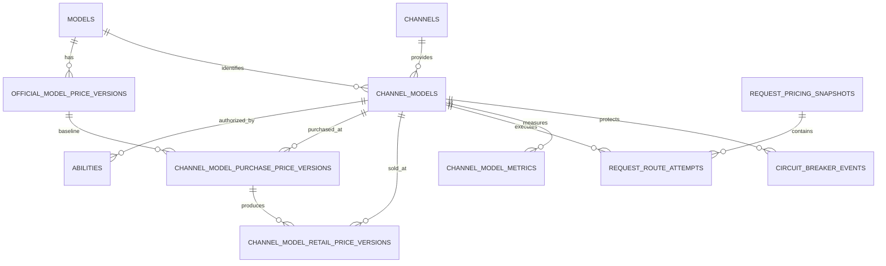

# 渠道模型独立采购、动态销售定价与智能路由技术方案

> 状态：企业级方案设计稿
> 适用项目：token-boat / new-api 二次开发
> 核心规则：客户售价由最终实际成功的渠道模型决定
> 价格层次：官方价目录/修订 → 渠道采购快照 → 渠道销售快照 → 请求结算快照

## 1. 方案摘要

平台接入多个上游渠道后，同一个逻辑模型在不同渠道可能具有不同的：

- 采购折扣或采购净价；
- 输入、输出、缓存、多模态价格；
- 币种和税务口径；
- 地区、数据政策和模型能力；
- 延迟、吞吐、成功率和容量；
- 最低消费、阶梯和合同条件。

本方案引入 `channel_models` 作为核心业务实体，将当前系统中的模型价格迁移为官方基准价格，并为每个渠道模型建立独立的采购价格和销售价格。

```text
客户请求逻辑模型
→ 查询有权限的渠道模型
→ 计算每个候选的采购成本和客户售价
→ 根据价格、利润、健康和 SLA 选路
→ 按允许候选最高预计售价预扣
→ 调用上游并记录每次尝试成本
→ 按最终成功渠道模型的销售价格结算
→ 计算平台总采购成本和实际毛利
```

关键原则：

1. `models` 只表示逻辑模型身份。
2. `channels` 只表示上游渠道或账号。
3. `channel_models` 表示某渠道具体提供某模型。
4. 官方价采用“当前目录 + 不可变修订 + 同步批次”；采购价、销售价采用不可变版本。
5. 客户售价跟随最终实际渠道模型变化。
6. 失败尝试的上游成本计入平台采购成本。
7. 请求开始时冻结价格候选，结算后历史价格不可改变。
8. 热路径只执行预生成的价格表达式，不临时拼装价格。
9. 新能力通过独立模块和少量桥接点接入，降低上游合并冲突。
10. `billing_mode` 描述计费对象，`price_structure` 描述价格组织方式，最终金额统一由版本化 `billing_expr` 执行。

## 2. 业务范围与不变量

### 2.1 本期范围

- 官方价格当前目录、不可变修订和同步批次；
- 渠道模型实体；
- 渠道报价录入和导入；
- 统一折扣、分项折扣、明确净价、混合报价和自定义报价；
- 渠道模型采购价格；
- 销售策略和渠道模型销售价格；
- 动态价格预扣和结算；
- 请求尝试成本、收入和利润；
- 成本、价格、利润和健康感知路由；
- 渠道模型级熔断；
- 价格审批、发布、缓存和审计；
- SQLite、MySQL、PostgreSQL 兼容。

### 2.2 暂不默认启用

- 未经客户授权的跨模型自动替换；
- 用实时汇率复算历史账单；
- 将失败尝试采购成本直接转嫁给客户；
- 根据单次请求动态判断年度税档；
- 用不可解释的模型自动决定销售价格。

### 2.3 财务不变量

```text
客户账本 = Retail Ledger
平台采购账本 = Procurement Ledger
平台毛利 = 客户收入 - 全部上游尝试采购成本 - 可归属其他成本
```

- 客户余额只由销售价格影响。
- 采购成本不直接扣减客户余额。
- 发布后的价格版本不能原地修改。
- 历史请求始终使用其冻结的价格版本。
- 缺失价格不得静默当作零成本。
- 任何价格和 quota 计算不得产生负数、NaN、Inf 或整数溢出。

## 3. 当前系统与改造边界

当前系统已有：

| 能力 | 现状 |
|---|---|
| 模型身份 | `models` |
| 渠道 | `channels` |
| 分组可用关系 | `abilities` |
| 模型映射 | `channels.model_mapping` |
| 模型价格 | options 中的 `ModelRatio`、`ModelPrice` |
| 复杂价格 | `ModelBillingMode`、`ModelBillingExpr` |
| 价格表达式 | `pkg/billingexpr` |
| 客户计费 | `PriceData`、预扣、结算和退款 |
| 路由 | priority + weight + retry |
| 健康处理 | 自动禁用渠道或 Key |
| 日志和对账 | usage log、task、channel daily usage |

当前缺口：

- 同一模型不能按渠道独立采购和销售定价；
- options Map 不适合审批、版本和历史复算；
- 路由无法感知实际采购价、销售价和利润；
- fallback 后无法切换客户销售价格；
- 失败尝试成本没有完整进入毛利；
- 熔断粒度不足；
- 采购敏感信息和客户价格缺少明确权限边界。

## 4. 核心实体与关联关系

### 4.1 每张表的一句话职责

| 表 | 职责 | 类型 |
|---|---|---|
| `models` | 平台对外的逻辑模型 | 主数据 |
| `channels` | 一个上游渠道、账号或 Key 池 | 主数据 |
| `channel_models` | 某渠道提供的某个模型 | 核心主数据 |
| `abilities` | 用户分组能否使用某个渠道模型 | 权限/路由配置 |
| `model_official_prices` | 每个模型当前官方价的读取入口 | 当前目录 |
| `official_model_price_versions` | 官方价不可变修订与来源证据 | 修订历史 |
| `official_price_sync_batches` | 定时同步的幂等、结果和错误审计 | 同步审计 |
| `channel_model_purchase_price_versions` | 渠道模型采购价格、常用分项和执行表达式 | 版本配置 |
| `channel_model_retail_price_versions` | 渠道模型销售价格、常用分项和计算参数快照 | 版本配置 |
| `request_pricing_snapshots` | 一次请求的预扣、最终价格和利润 | 请求流水 |
| `request_route_attempts` | 一次请求的每次渠道尝试与成本 | 尝试流水 |
| `channel_model_metrics` | 渠道模型性能和财务聚合 | 指标 |
| `circuit_breaker_events` | 熔断状态变更审计 | 审计 |

### 4.2 主外键关系



对应外键：

```text
models.id
├── official_model_price_versions.model_id
└── channel_models.model_id

channels.id
└── channel_models.channel_id

channel_models.id
├── abilities.channel_model_id
├── channel_model_purchase_price_versions.channel_model_id
├── channel_model_retail_price_versions.channel_model_id
├── request_route_attempts.channel_model_id
├── request_pricing_snapshots.final_channel_model_id
└── channel_model_metrics.channel_model_id

official_model_price_versions.id
└── channel_model_purchase_price_versions.official_price_version_id（可空）

channel_model_purchase_price_versions.id
├── channel_model_retail_price_versions.purchase_price_version_id
└── request_route_attempts.purchase_price_version_id

channel_model_retail_price_versions.id
└── request_pricing_snapshots.retail_price_version_id

request_pricing_snapshots.id
└── request_route_attempts.request_pricing_id
```

### 4.3 为什么 `channel_model` 是核心

```text
Channel 18：OpenAI Official A
Model 52：GPT-5.1

ChannelModel 101：
OpenAI Official A 渠道上的 GPT-5.1
```

价格、指标和熔断应当绑定 `channel_model_id=101`，而不是只绑定渠道 18。否则 GPT-5.1 故障可能错误影响该渠道中的其他模型。

### 4.4 `abilities` 与 `channel_models`

```text
channel_models = 渠道模型本体
abilities = 分组对渠道模型的授权和路由覆盖
```

同一个渠道模型可被多个分组引用：

```text
ChannelModel 101
├── default：启用，priority=10
├── vip：启用，priority=20
├── internal：启用，priority=100
└── restricted：禁用
```

迁移期在 `abilities` 新增 nullable `channel_model_id`，保留旧 `channel_id + model`。权威来源按阶段切换：

```text
阶段 1：
旧 channel_id + model 为权威
channel_model_id 回填并做影子一致性检查

阶段 2：
channel_model_id 为权威
旧字段仅用于兼容输出和上游旧代码

阶段 3：
停止写入旧关联字段
```

双写结果不一致时必须记录错误并阻止发布渠道配置，不能随机选择一边。迁移实施前还要核对 `abilities` 现有复合主键和唯一索引；增加普通 nullable 字段不会自动改变旧唯一性语义。

## 5. 定价模型

### 5.1 价格层次

```text
Official Price
→ Purchase Price
→ Retail Price
→ Request Snapshot
```

### 5.2 目标净利润公式

定义：

| 符号 | 含义 |
|---|---|
| `OP` | 官方原价 |
| `PD` | 采购折扣 |
| `PC` | 采购成本 |
| `TR` | 有效所得税规划率 |
| `VCR` | 总变动运营成本率 |
| `TM` | 目标税后净利润率 |
| `S` | 销售价格 |

```text
PC = OP × PD

S = PC × (1 - TR)
    / ((1 - VCR) × (1 - TR) - TM)
```

统一折扣场景下：

```text
RetailRatio =
PD × (1 - TR)
/
((1 - VCR) × (1 - TR) - TM)
```

必须校验：

```text
(1 - VCR) × (1 - TR) - TM > 0
```

### 5.3 VCR 构成

```text
VCR =
PaymentFeeRate
+ DistributionFeeRate
+ VariableOperationRate
+ RiskReserveRate
+ BadDebtRate
```

每笔固定费用不能直接放入百分比，应进入后续支持的固定成本项。

VCR、TR、TM 等参数直接冻结在 `channel_model_retail_price_versions` 中，不再建立独立的版本化销售策略表。后台可以提供系统默认值或简单录入模板，但模板只负责填充表单，不参与计费依赖，也不影响已经发布的销售价格。

管理端的 VCR、TR、TM 和最低利润率统一使用百分比录入与展示，例如填写 `16.5` 表示 `16.5%`；提交 API 和数据库快照仍使用 `[0, 1)` 小数，分别保存为 `0.165`。前端必须在 API 边界完成双向转换，避免管理员混用百分比与小数。

### 5.4 五种供应商报价模式

采购价格不一定依赖官方价格。依赖关系由 `pricing_mode` 决定：

| 报价模式 | 是否必须关联官方价格 |
|---|---|
| `official_ratio` | 必须 |
| `component_ratio` | 必须 |
| `fixed_unit_price` | 不需要 |
| `hybrid` | 只要存在继承官方价或官方折扣的分项就必须 |
| `custom_expr` | 默认不需要；表达式明确以官方价格为基准时才关联 |

因此：

```text
channel_model_purchase_price_versions.official_price_version_id
```

必须设计为 nullable。它表达“该采购报价的计算基准”，而不是所有采购价格都必须具备的父记录。

#### `official_ratio`

统一折扣：

```json
{
  "pricing_mode": "official_ratio",
  "purchase_discount": "0.65"
}
```

管理后台采用中国商务报价习惯输入“折数”，API 与数据库仍保存便于计算的“采购倍率”：

```text
后台输入：7      → 7 折
API/数据库：0.7 → 官方价 × 70%
实际降幅：30%
```

因此统一折扣与分项折扣都必须在前端完成无损换算；详情统一展示为
`7 折（官方价 × 70%）`，不能展示成“优惠 70%”。例如 `6.5 折` 在
API/数据库中保存为 `0.65`。

官方：

```text
p*1.25 + c*10 + cr*0.125
```

采购：

```text
p*0.8125 + c*6.5 + cr*0.08125
```

#### `component_ratio`

分项折扣：

```json
{
  "pricing_mode": "component_ratio",
  "quote_spec": {
    "input": {"ratio": "0.65"},
    "output": {"ratio": "0.70"},
    "cache_read": {"ratio": "0.50"}
  }
}
```

#### `fixed_unit_price`

明确净价：

```json
{
  "pricing_mode": "fixed_unit_price",
  "currency": "USD",
  "quote_spec": {
    "input": {"price": "0.80", "unit": "per_1m_tokens"},
    "output": {"price": "6.00", "unit": "per_1m_tokens"},
    "cache_read": {"price": "0.08", "unit": "per_1m_tokens"}
  }
}
```

采购表达式：

```text
p*0.8 + c*6 + cr*0.08
```

#### `hybrid`

部分净价、部分折扣：

```json
{
  "pricing_mode": "hybrid",
  "default_rule": {
    "type": "official_ratio",
    "ratio": "0.60"
  },
  "quote_spec": {
    "input": {
      "type": "fixed_price",
      "price": "0.80",
      "unit": "per_1m_tokens"
    },
    "output": {
      "type": "fixed_price",
      "price": "6.00",
      "unit": "per_1m_tokens"
    },
    "cache_read": {
      "type": "official_ratio",
      "ratio": "0.50"
    }
  }
}
```

#### `custom_expr`

复杂阶梯或条件报价：

```text
len <= 200000
  ? tier("standard", p*0.8 + c*6 + cr*0.08)
  : tier("long_context", p*1.6 + c*9 + cr*0.16)
```

适用：

- 长上下文；
- Batch；
- 图片、音频、视频；
- 按次、按秒；
- 请求参数条件；
- 时间段价格；
- 最低单次费用。

### 5.5 未报价分项

必须显式配置：

| 规则 | 行为 |
|---|---|
| `reject` | 缺少价格项时禁止发布，默认 |
| `official_price` | 使用官方原价 |
| `official_ratio` | 使用默认折扣 |
| `zero` | 按零成本，仅允许特殊审批 |
| `not_supported` | 渠道不允许出现对应 usage |

禁止静默将缺失项当作零。

### 5.6 报价归一化


必须保留：

```text
原始供应商报价
结构化 quote_spec、常用价格列和 price_components
最终 purchase_billing_expr
```

### 5.7 分项采购价对应的销售价

统一折扣时可展示单一 `retail_ratio`。

分项折扣或固定净价时，必须逐项计算：

```text
RetailInputPrice =
PurchaseInputPrice × (1 - TR)
/
((1 - VCR) × (1 - TR) - TM)

RetailOutputPrice =
PurchaseOutputPrice × (1 - TR)
/
((1 - VCR) × (1 - TR) - TM)
```

最终客户计费以完整 `retail_billing_expr` 为准，单一销售折扣只作为展示值。

### 5.8 统一多模态结算用量

采购结算和销售结算必须使用同一个规范化用量对象，禁止两套账各自解析 provider usage：

```go
type BillableUsage struct {
    InputTokens        int64
    OutputTokens       int64
    CacheReadTokens    int64
    CacheWriteTokens   int64
    CacheWrite1HTokens int64

    ImageInputTokens  int64
    ImageOutputTokens int64
    AudioInputTokens  int64
    AudioOutputTokens int64

    ImageCount     int64
    VideoSeconds   decimal.Decimal
    AudioSeconds   decimal.Decimal
    CharacterCount int64
    WebSearchCount int64
    ToolCallCount  int64

    UsageSource string
}
```

`UsageSource`：

```text
provider
local
request
estimated
```

所有 provider adapter 将上游 usage 转换为 `BillableUsage`。采购表达式和销售表达式使用同一对象结算，避免成本账与收入账使用不同数量。

### 5.9 计费模式、价格结构与表达式

三者职责必须分开：

| 概念 | 回答的问题 | 示例 |
|---|---|---|
| `billing_mode` | 按什么业务量计费 | token、request、image、audio_duration、video_duration、character、mixed |
| `price_structure` | 价格规则如何组织 | flat、tiered、expression |
| `billing_expr` | 最终金额如何执行计算 | `purchase_billing_expr`、`retail_billing_expr` |

表达式不是与 Token、图片、视频并列的业务计费模式，而是所有计费模式底层统一的执行事实：

```text
billing_mode
→ 决定允许使用的规范化用量和请求维度
→ price_components / 阶梯配置
→ 编译生成 billing_expr
→ 预扣和结算执行
```

普通固定价、分项折扣和阶梯价格均由可视化配置生成表达式；只有标准结构无法描述时才允许直接编辑自定义表达式。

```text
expression_source:
  generated  系统根据结构化表单生成
  template   从受控模板生成
  custom     高级权限直接编辑
```

表达式版本执行以下规范：

- 新建、编辑和定时同步的官方价、采购价、销售价，数据库内统一保存显式 `v2:` 前缀，Token 模式也不例外；
- 管理员不需要手工输入前缀，Service 会按 `expression_schema_version` 自动补齐；
- 如果表达式已经显式携带前缀但与 `expression_schema_version` 不一致，拒绝保存或发布；
- 复制、导入或同步 V1 表达式进入新定价链时，Service 自动在表达式外层补充等价的 `/ 1,000,000` 换算并转存为 V2，保证实际 USD 金额不变；
- new-api 原有未带前缀的 `ModelBillingExpr` 继续按 V1 执行，不做破坏性迁移；
- 已发布的 V1 历史快照保持不可变，不做原地改写；从历史版本复制出的新草稿保存后统一成为 V2；
- 前缀是执行语义版本，不是价格版本号，也不能自由填写。

V1 与 V2 的核心区别：

| 维度 | V1（new-api 原有 Token 表达式） | V2（新增统一业务计费表达式） |
|---|---|---|
| 适用对象 | Token、缓存 Token、多模态 Token | 请求、图片张数、音视频秒数、字符数，也可承载 Token |
| 主要变量 | `p`、`c`、`len`、`cr`、`cc`、`cc1h`、`img`、`img_o`、`ai`、`ao` | 继承 V1，并增加 `req`、`images`、`audio_s`、`video_s`、`chars` |
| 表达式输出 | “Token 数 × USD/百万 Token”的加权值 | 实际 USD 金额 |
| Token 换算 | 结算层统一除以 `1,000,000` | 表达式内显式 `/ 1,000,000` |
| 兼容策略 | 仅用于原 new-api 配置和历史快照；无前缀默认按 V1 | 新官方价、采购价和销售价必须显式保存为 `v2:` |

因此示例：

```text
v2:(tier("base", p * 0.4 + c * 1.6)) / 1000000
```

表示输入 0.4 USD/百万 Token、输出 1.6 USD/百万 Token。管理端可视化编辑器仍让管理员直接填写 `0.4` 和 `1.6`，`/ 1000000` 由系统生成；按视频秒计费则写为：

```text
v2:tier("1080p", video_s * 0.3402)
```

现有 `pkg/billingexpr` 的表达式版本、变量语义、AST 用量归一化和 quota 换算是唯一执行标准，新模块不得另建语法。

## 6. 数据表设计

### 6.1 官方价目录、修订和同步批次

官方价不是运行时账单快照，也不需要采购/销售那样的复杂生命周期。为兼顾定时同步、快速读取和审计，拆成三层：

```text
model_official_prices（每个模型一行）
└── current_revision_id
    └── official_model_price_versions（只追加修订）

official_price_sync_batches
└── official_model_price_versions.sync_batch_id
```

`model_official_prices` 是业务读取入口；`official_model_price_versions` 是来源证据。同步时只有内容哈希变化才新增修订并推进当前指针，完全相同的报价不会制造空版本。

#### `model_official_prices`

| 字段 | 类型 | 说明 |
|---|---|---|
| `model_id` | int | 主键，一模型一行 |
| `current_revision_id` | int | 当前生效修订 |
| `updated_at` | bigint | 当前指针更新时间 |

#### `official_model_price_versions`

> 本节描述当前代码中 `model.OfficialModelPriceVersion` 已实际落地的字段，不包含规划字段。

| 字段 | 类型 | 说明 |
|---|---|---|
| `id` | int | 主键 |
| `model_id` | int，非空 | 逻辑模型 ID；与 `version` 组成唯一索引 |
| `billing_mode` | varchar(32) | token、request、image、audio_duration、video_duration、mixed 等 |
| `price_structure` | varchar(16)，非空 | flat、tiered、expression |
| `price_components` | text | 结构化价格分项 JSON；用于管理端展示、复制和同步比较 |
| `billing_expr` | text，非空 | 官方价格执行表达式 |
| `expr_hash` | varchar(64)，非空 | `billing_expr` 的 SHA-256，用于表达式完整性校验 |
| `expression_source` | varchar(16)，非空 | generated、template、custom |
| `expression_schema_version` | varchar(16)，非空 | 表达式环境和语义版本；新定价链统一为 v2，v1 仅保留历史兼容 |
| `currency` | varchar(8)，非空 | 币种，保存时标准化为大写 |
| `source` | varchar(32)，非空 | manual、official_api、legacy_import 等 |
| `source_version` | varchar(64) | 官方版本 |
| `content_hash` | varchar(64) | 计费模式、价格结构、价格分项、表达式和币种的语义哈希，用于同步去重 |
| `sync_batch_id` | int，可空 | `official_price_sync_batches.id`；人工维护时为空 |
| `source_updated_at` | bigint | 上游报价更新时间 |
| `change_type` | varchar(16) | initial、updated；人工草稿当前可为空 |
| `version` | bigint，非空 | 模型内递增版本；与 `model_id` 组成唯一索引 |
| `status` | varchar(16)，非空 | draft、active、expired；旧数据可能存在 suspended |
| `effective_from` | bigint，非空 | 生效时间；草稿为 0 |
| `effective_to` | bigint | 被替代时间；当前生效版本为 0 |
| `created_by` | int | 操作人或同步任务身份 |
| `created_at` | bigint | 创建时间 |
| `updated_at` | bigint | 更新时间 |
| `remark` | varchar(255) | 备注 |

当前 GORM 索引：

```text
UNIQUE uk_official_model_price_version(model_id, version)
INDEX(model_id)
INDEX(status)
INDEX(effective_from)
INDEX(effective_to)
INDEX(content_hash)
INDEX(sync_batch_id)
INDEX(source_updated_at)
```

以下字段不在当前表中：`release_id`、`approved_by`、`approved_at`、`scheduled_at`、`is_structured`。其中结构化与否由 `price_structure + price_components` 表达；当前官方价由 `model_official_prices.current_revision_id` 指向，不在修订表增加 `is_current`。

#### `official_price_sync_batches`

| 字段 | 类型 | 说明 |
|---|---|---|
| `id` | int | 主键 |
| `source` | varchar(32) | official_api、vendor_feed 等 |
| `idempotency_key` | varchar(128) | 来源批次唯一键 |
| `status` | varchar(16) | running、completed、failed |
| `received_count` | int | 接收模型数 |
| `changed_count` | int | 新增修订数 |
| `unchanged_count` | int | 内容未变化数 |
| `activated_count` | int | 自动推进当前指针数 |
| `started_at/completed_at` | bigint | 批次耗时审计 |
| `created_by` | int | 操作人或任务身份 |
| `error_message` | text | 失败原因 |

唯一索引 `UNIQUE(source, idempotency_key)` 保证调度器重试不会重复生成价格修订。

### 6.2 `channel_models`

| 字段 | 类型 | 说明 |
|---|---|---|
| `id` | int | 主键 |
| `channel_id` | int | 渠道 |
| `model_id` | int | 逻辑模型 |
| `upstream_model_name` | varchar(192) | 实际上游模型名 |
| `status` | int | 单模型启停 |
| `priority` | bigint | 默认优先级 |
| `weight` | int | 默认权重 |
| `region` | varchar(32) | 地区 |
| `data_policy` | varchar(32) | 数据策略 |
| `capability_config` | text | 能力 JSON |
| `routing_tags` | varchar(255) | 标签 |
| `created_at/updated_at` | bigint | 时间 |

```text
UNIQUE(channel_id, model_id, upstream_model_name)
INDEX(model_id, status)
INDEX(channel_id, status)
```

### 6.3 `channel_model_purchase_price_versions`

| 字段 | 说明 |
|---|---|
| `id` | 主键 |
| `channel_model_id` | 渠道模型 |
| `official_price_version_id` | 可空；采购价格引用的官方基准版本 |
| `billing_mode` | token、request、image、audio_duration、video_duration、character、mixed 等 |
| `pricing_mode` | 五种报价模式 |
| `default_rule` | 缺失分项规则 JSON |
| `quote_spec` | 结构化报价 JSON |
| `purchase_discount` | 统一采购倍率；API/数据库保存 `0.7` 表示后台录入的 7 折 |
| `price_structure` | flat、tiered、expression |
| `input_unit_price` | 可空；输入采购单价 |
| `output_unit_price` | 可空；输出采购单价 |
| `cache_read_unit_price` | 可空；缓存读取采购单价 |
| `cache_write_unit_price` | 可空；缓存写入采购单价 |
| `price_unit` | 常用单价单位，例如 per_1m_tokens |
| `price_components` | 其他分项和多档位价格 JSON |
| `purchase_billing_expr` | 最终采购表达式 |
| `purchase_expr_hash` | 表达式 Hash |
| `expression_source` | generated、template、custom |
| `expression_schema_version` | 表达式环境和语义版本 |
| `currency` | 币种 |
| `quote_reference` | 报价单编号 |
| `contract_reference` | 合同编号 |
| `source_document_id` | 原始文件引用 |
| `conditions` | 商务条件 JSON |
| `normalizer_version` | 转换器版本 |
| `version/status` | 版本和状态 |
| `effective_from/to` | 生效区间 |
| `release_id` | 发布批次 |
| `approval_status` | 审批状态 |
| `created_by/approved_by` | 操作人 |
| `created_at/updated_at` | 时间 |
| `remark` | 备注 |

按报价模式执行应用层约束：

```text
official_ratio:
  official_price_version_id 必填
  purchase_discount 必填

component_ratio:
  official_price_version_id 必填
  quote_spec 分项 ratio 必填

fixed_unit_price:
  official_price_version_id 可空
  quote_spec 中明确净价、币种和单位必填

hybrid:
  如果任一分项使用 official_ratio、official_price 或 inherited
  → official_price_version_id 必填
  否则可空

custom_expr:
  official_price_version_id 默认可空
  purchase_billing_expr 必填
```

数据库外键只能表达“有值时必须存在”，不能表达上述条件组合，因此这些约束由 Service 层在创建、审批和发布时统一验证。

常用采购分项直接保存在版本表中，避免额外明细表：

```text
input_unit_price
output_unit_price
cache_read_unit_price
cache_write_unit_price
```

图片、音频、视频、多档位和供应商特有分项保存在 `price_components` JSON 中。`purchase_billing_expr` 仍然是请求运行时唯一采购计费事实。

### 6.4 `channel_model_retail_price_versions`

该表保存平台实际向客户收取的销售价格版本。销售价由采购价结合运营成本、税率、目标利润、价格保护或人工调整生成。

例如采购价格：

```text
输入采购价：0.80 USD / 1M tokens
输出采购价：6.00 USD / 1M tokens
```

应用 VCR、TR、TM 后，销售价格可能是：

```text
输入销售价：1.18 USD / 1M tokens
输出销售价：8.85 USD / 1M tokens
```

这两组价格用途不同：

```text
purchase price → 平台成本、选路、供应商对账
retail price   → 客户预扣、客户结算、收入
```

| 字段 | 说明 |
|---|---|
| `id` | 主键 |
| `channel_model_id` | 渠道模型 |
| `official_price_version_id` | 可空；用于官方折扣展示或销售规则引用 |
| `purchase_price_version_id` | 采购价版本 |
| `billing_mode` | 从采购价格继承的实际计费模式 |
| `strategy/formula_version` | 计算方式 |
| `purchase_discount` | 统一折扣快照，可为空 |
| `payment_fee_rate` | 付款服务费率快照 |
| `distribution_fee_rate` | 分销费用率快照 |
| `variable_operation_rate` | 变动运维成本率快照 |
| `risk_reserve_rate` | 风险准备金率快照 |
| `bad_debt_rate` | 坏账率快照 |
| `total_variable_cost_rate` | VCR 快照 |
| `effective_tax_rate` | TR 快照 |
| `target_net_margin` | TM 快照 |
| `calculated_retail_ratio` | 计算比例，可为空 |
| `applied_retail_ratio` | 最终应用比例，可为空 |
| `price_structure` | flat、tiered、expression |
| `input_unit_price` | 可空；最终输入销售单价 |
| `output_unit_price` | 可空；最终输出销售单价 |
| `cache_read_unit_price` | 可空；最终缓存读取销售单价 |
| `cache_write_unit_price` | 可空；最终缓存写入销售单价 |
| `price_unit` | 常用单价单位 |
| `price_components` | 其他分项和多档位销售价格 JSON |
| `retail_billing_expr` | 最终销售表达式 |
| `retail_expr_hash` | 表达式 Hash |
| `expression_source` | generated、template、custom |
| `expression_schema_version` | 表达式环境和语义版本 |
| `currency` | 币种 |
| `retail_ratio_floor/ceiling` | 上下限快照 |
| `minimum_margin_rate` | 最低利润快照 |
| `version/status` | 版本和状态 |
| `effective_from/to` | 生效区间 |
| `release_id` | 发布批次 |
| `approval_status` | 审批状态 |
| `created_by/approved_by` | 操作人 |
| `created_at/updated_at` | 时间 |

实际计费只执行 `retail_billing_expr`。

采购版本和销售版本必须分开，主要因为生命周期不同：

```text
供应商采购报价不变
→ 平台调整目标利润或支付费率
→ 只需要创建新销售版本

供应商采购报价变化
→ 创建新采购版本
→ 再生成对应的新销售版本
```

如果把销售价直接放进采购分项，平台每次调整销售价格都要伪造一个新的采购报价版本，导致供应商对账和价格审计失真。

销售价格的强依赖应当是：

```text
channel_model_retail_price_versions
→ channel_model_purchase_price_versions
```

而不是强制依赖官方价格。对于固定采购净价：

```text
供应商明确净价
→ 生成采购表达式
→ 根据采购表达式和销售策略生成销售表达式
```

整个计算链可以完全不使用官方价格。

如果为了后台展示“相对官方价多少折”而绑定官方价格，这个关联仅是比较基准：

```text
display_reference
```

不得影响已经发布的采购和销售表达式。

销售版本本身保存完整的 VCR、TR、TM、价格保护和公式版本，因此无需读取其他策略表即可解释和复算销售价格。

后台如需复用相同参数，可以提供非版本化的“默认定价模板”或系统设置：

```text
模板参数
→ 创建销售价格时复制
→ 冻结到 channel_model_retail_price_versions
```

模板后续发生变化，不影响已经发布的销售价格版本。

销售版本生成时，同时写入常用销售单价列、扩展 `price_components` 和最终 `retail_billing_expr`。三者必须由同一次计算生成，禁止分别编辑。

采购版本和销售版本必须通过活动价格束一起发布：

```go
type ActivePriceBundle struct {
    ChannelModelID         int
    PurchasePriceVersionID int
    RetailPriceVersionID   int
    PricingRevision        int64
}
```

约束：

```text
active retail.purchase_price_version_id
==
active bundle.purchase_price_version_id
```

采购价格变化但客户售价保持不变时，也要创建内容相同的新销售版本，并引用新的采购版本。这样预计利润、实际成本和历史审计始终使用同一价格链。

对于无法安全分解的 `custom_expr`：

- `price_structure=expression`；
- 常用单价列允许为空；
- 前端显示“复杂计价”；
- 不参与简单最低输入、输出价格比较；
- 实际计费仍使用 `retail_billing_expr`。

`price_structure` 发布约束：

| 结构 | 必填和校验 |
|---|---|
| `flat` | 至少一个常用单价列或单一单位的 `price_components`；必须能重新生成表达式 |
| `tiered` | `price_components.tiers`、每档条件、币种和单位完整；条件不得重叠或留空 |
| `expression` | billing expr 必填；不能安全分解时常用单价列必须为空，避免误导展示 |

结构化价格发布时必须执行：

```text
常用价格列 + price_components
→ 规范化生成 billing expr
→ 计算 Hash
→ 必须等于保存的 expr_hash
```

任何一方不一致都拒绝发布，避免后台展示价格与实际计费表达式不同。

### 6.5 前端模型最低价的重新评估

删除 `model_retail_price_summaries` 后，第一期不再建立最低价聚合表。

前端模型列表的最低价由内存价格目录实时聚合：

```text
CandidatesByGroupAndModel
+ ActivePriceBundleByChannelModelID
→ ModelMinimumRetailPrices
```

聚合过程：

1. 读取某分组和模型的候选 `channel_model_id`；
2. 排除渠道、渠道模型或 ability 已禁用的候选；
3. 读取每个候选当前有效销售版本；
4. 只直接比较 `price_structure=flat`、币种和单位一致的价格；
5. 分别计算 `input_unit_price`、`output_unit_price`、缓存价格的最小值；
6. API 返回最低价格及对应 `channel_model_id`；
7. 结果随 `pricing_revision` 缓存在内存中。

不建议将短期熔断状态写入公开最低价格，否则模型列表会频繁跳价。可以分别返回：

```text
minimum_configured_price
minimum_currently_available_price
```

前者忽略短期熔断，后者由实时路由目录按需计算。

输入最低价和输出最低价可能来自不同渠道模型，API 必须分别返回来源：

```json
{
  "input": {
    "price": "1.00",
    "channel_model_id": 101
  },
  "output": {
    "price": "8.00",
    "channel_model_id": 102
  }
}
```

禁止将两个渠道的最低分项拼成一个不存在的“最低组合价格”。请求级最低总价必须基于同一个渠道模型、实际输入量和预计输出量计算。

直接数据库查询也可行，因为常用价格已经提升为明确列，但正常前端请求应优先使用内存价格目录，避免每次跨 `models`、`abilities`、`channel_models`、`channels` 和销售版本表聚合。

重新引入持久化汇总表的条件：

- 活跃渠道模型达到数十万级；
- 分组数量很大且最低价组合爆炸；
- 多实例重复聚合产生明显 CPU 或延迟压力；
- 需要数据库离线导出全部分组最低价；
- 实际监控证明内存聚合无法满足 SLA。

在出现上述数据之前，`model_retail_price_summaries` 属于不必要的派生数据和一致性负担，应保持删除。

### 6.6 Seedance 等视频模型的前端展示与价格来源

视频模型不能套用文本模型的“输入价/输出价”展示。用户侧价格必须来自当前用户分组可使用的有效 `channel_model_retail_price_versions`，不能读取官方价格、采购成本，也不能由前端执行表达式。

价格链路：

```text
official_model_price_versions
→ channel_model_purchase_price_versions
→ channel_model_retail_price_versions
→ 后端价格目录和报价服务
→ 用户前端
→ 请求价格快照和最终结算
```

Seedance 一类模型可定义：

```text
billing_mode = video_duration
price_structure = flat | tiered | expression
```

其 `price_components` 可以按以下维度组织：

```text
生成模式：文生视频、图生视频
单位：second
分辨率：720p、1080p 等
是否含音频
帧率
最短和最长生成时长
```

模型列表只展示后端基于明确“展示基准规格”计算出的起价：

```text
Seedance 2.0
最低 ¥0.12 / 秒起
基准规格：720p、无音频、5 秒
```

不能直接对 JSON 中的某个 `unit_price` 做 `MIN`，因为最低价可能受规格、用户分组、阶梯、表达式和渠道可用性影响。后端必须使用同一份标准化模拟用量，对每个候选渠道模型的完整销售表达式求值后比较。

视频创建页面通过精确报价接口展示：

```text
生成模式：[文生视频]
分辨率：  [1080p]
时长：    [10 秒]
音频：    [包含]
数量：    [1]

预计价格：¥2.60
10 秒 × ¥0.26/秒
报价有效期至 12:05
```

平台支持两种销售体验：

1. 动态渠道售价：实际成功使用哪个渠道模型，就按其销售版本结算；列表必须显示“起”，请求前返回短期有效报价。
2. 统一对外售价：所有可路由渠道对客户使用同一销售价，路由在满足利润红线的渠道中选择；更适合公共零售和企业预算管理。

建议默认采用统一对外售价，动态渠道售价作为分组或合同级能力。无论哪种模式，请求开始时都必须冻结报价、销售版本和候选价格束。

### 6.7 `request_pricing_snapshots`

关键字段：

```text
id
request_id
user_id
token_id
group
origin_model_name
reserved_quota
actual_quota
final_channel_model_id
official_price_version_id
purchase_price_version_id
retail_price_version_id
route_plan_snapshot
candidate_price_cap_usd
retail_expr
retail_expr_hash
estimated_retail_usd
actual_retail_usd
total_provider_cost_usd
gross_profit_usd
gross_margin_rate
currency
pricing_revision
status
created_at
settled_at
```

### 6.8 `request_route_attempts`

关键字段：

```text
id
request_pricing_id
request_id
attempt_index
channel_model_id
channel_id
upstream_model_name
purchase_price_version_id
purchase_expr
purchase_expr_hash
retail_price_version_id
retail_expr
retail_expr_hash
estimated_cost_usd
calculated_cost_usd
provider_reported_cost_usd
actual_cost_usd
settled_cost_usd
estimated_retail_usd
cost_source
cost_status
status
status_code
error_code
input_tokens
output_tokens
cache_read_tokens
cache_write_tokens
response_committed
started_at
first_token_at
finished_at
```

`cost_source`：

```text
provider_reported
calculated_from_usage
calculated_from_request
estimated
unknown
```

`cost_status`：

```text
estimated
provisional
final
reconciled
disputed
```

利润报表优先使用 `settled_cost_usd`。上游没有返回金额时，可先由规范化 usage 计算 provisional 成本，之后通过供应商账单或 Cost API 回补和对账。

### 6.9 指标和熔断

`channel_model_metrics`：

```text
channel_model_id
endpoint_type
bucket_ts
request_count
success_count
retryable_error_count
rate_limit_count
timeout_count
midstream_error_count
total_latency_ms
ttft_sum_ms
output_tokens
generation_ms
retail_revenue_usd
provider_cost_usd
```

`circuit_breaker_events`：

```text
scope_type
scope_key
previous_state
new_state
reason
failure_rate
sample_count
opened_at
recovery_at
created_at
```

## 7. 完整示例

### 7.1 主数据

`models`：

| id | model_name |
|---:|---|
| 52 | gpt-5.1 |

`channels`：

| id | name |
|---:|---|
| 18 | OpenAI Official A |
| 23 | Azure OpenAI HK |

`channel_models`：

| id | channel_id | model_id | upstream_model_name |
|---:|---:|---:|---|
| 101 | 18 | 52 | gpt-5.1 |
| 102 | 23 | 52 | deployment-gpt-51-hk |

`abilities`：

| group | channel_model_id | enabled |
|---|---:|---:|
| default | 101 | 1 |
| default | 102 | 1 |

### 7.2 官方、采购和销售价格

官方版本：

```text
ID 201
p*1.25 + c*10 + cr*0.125
```

采购版本：

```text
ID 301 / ChannelModel 101 / 65 折
p*0.8125 + c*6.5 + cr*0.08125

ID 302 / ChannelModel 102 / 明确净价
p*0.70 + c*5.8 + cr*0.07
```

生成销售价格时使用的参数直接冻结到销售版本：

```text
VCR = 0.08
TR = 0.165
TM = 0.20
```

生成销售版本：

```text
ID 501 → ChannelModel 101 → Purchase Version 301
ID 502 → ChannelModel 102 → Purchase Version 302
```

### 7.3 请求执行

请求：

```text
模型：gpt-5.1
分组：default
预计输入：10,000
预计输出：2,000
```

过程：

1. 模型缓存找到 `model_id=52`。
2. 权限缓存得到候选 `[101, 102]`。
3. 加载采购版本 `[301, 302]` 和销售版本 `[501, 502]`。
4. 计算每个候选的预计采购成本和客户售价。
5. 经过健康、能力、价格上限过滤。
6. 路由器选择 102。
7. 按所有允许 fallback 候选中的最高预计销售价预扣。
8. 创建请求价格快照。
9. 创建 102 的尝试记录。
10. 如果 102 成功，客户按销售版本 502 结算。
11. 如果 102 在提交响应前失败，再尝试 101。
12. 如果 101 成功，客户按销售版本 501 结算。
13. 平台采购成本为 102 失败成本加 101 成功成本。

## 8. 官方价格变化

### 8.1 当前目录与不可变修订

官方价格变化时：

```text
定时任务拉取报价
→ 创建 official_price_sync_batches
→ 标准化并计算 content_hash
→ 相同：记录 unchanged，不写新修订
→ 变化：写入不可变修订
→ 可信来源且通过阈值：推进 model_official_prices.current_revision_id
→ 非可信来源或异常变化：保留 draft，等待人工确认
```

不修改：

- `models`；
- `channels`；
- `channel_models`；
- `abilities`；
- 历史请求快照；
- 历史尝试流水。

尤其不会自动修改已有 `channel_model_purchase_price_versions`。采购版本已经冻结了采购表达式和分项净价，`official_price_version_id` 只保留来源血缘。官方价变更后：

- 新建的折扣采购草稿默认读取当前官方价；
- 已有采购版本继续按自己的快照执行；
- 管理端可派生展示 `current`、`outdated`、`independent`；
- `fixed_unit_price` 等独立净价显示为 `independent`，不参与官方价过期判断。

官方价状态只表达目录语义，不表达采购可引用性：

- `draft` 仍可修改或删除，禁止被采购价引用；
- `active` 是当前官方基准，默认用于新建采购草稿；
- `expired` 是已被新修订替代的历史基准，但修订内容不可变，仍允许被采购价显式选择和引用。

因此采购价不是“只能引用生效官方价”，而是“可引用任一已发布官方修订”。采购版本保存时冻结折后价格、表达式和 `official_price_version_id`，后续官方目录切换不会改变该采购快照。

### 8.2 不同采购模式的处理

| 采购模式 | 官方调价后的处理 |
|---|---|
| `official_ratio` | 标记 outdated，可一键基于最新官方价生成新采购草稿 |
| `component_ratio` | 标记 outdated，可按分项折扣生成新采购草稿 |
| `fixed_unit_price` | 标记待复核，净价默认不变 |
| `hybrid` | 仅将继承官方价的分项标记 outdated |
| `custom_expr` | 标记待人工或规则复核 |

### 8.3 发布边界

官方价发布只切换官方当前目录，不与采购、销售组成强制原子发布：

```text
官方价修订 A → 被既有采购版本引用，长期保留
官方价修订 B → 当前目录，供新采购草稿读取
```

因此发布新官方价不得因旧官方价仍被生效采购版本引用而阻塞。采购与销售仍是两个独立、不可变的审计快照，但价格链切换必须原子执行：发布销售草稿时，若其绑定的采购版本仍是草稿，则在同一数据库事务中先完成采购发布校验，再同时激活采购和销售版本；若绑定采购已经生效，则只切换销售版本。任一步校验或写入失败都必须整体回滚，不能留下“采购已生效、销售未生效”的半发布状态。

### 8.4 进行中请求

请求和异步任务继续使用创建时冻结的版本。只有价格生效后的新请求使用新版本。

## 9. 预扣、重试和结算

### 9.1 预扣

动态售价下默认：

```text
预扣 = 允许候选渠道模型中的最高预计销售费用
```

预计输出量：

```text
min(
  请求 max_tokens 或 max_output_tokens,
  模型和业务历史输出 P75/P90,
  系统安全上限
)
```

请求未提供最大输出量时必须使用安全默认值，不能按零输出预扣。预扣可增加小比例安全缓冲，但缓冲比例必须配置、审计并向财务说明。

候选必须先经过：

- 分组权限；
- 能力和上下文；
- 地区和数据政策；
- 容量；
- 熔断；
- 客户价格上限。

建议支持：

```json
{
  "routing": {
    "max_retail_ratio": 0.95,
    "allow_higher_price_fallback": false
  }
}
```

请求开始时冻结 `RoutePlanSnapshot`：

```json
{
  "pricing_revision": 202609010001,
  "candidates": [
    {
      "channel_model_id": 101,
      "purchase_price_version_id": 301,
      "retail_price_version_id": 501,
      "estimated_retail_usd": "0.0310"
    },
    {
      "channel_model_id": 102,
      "purchase_price_version_id": 302,
      "retail_price_version_id": 502,
      "estimated_retail_usd": "0.0272"
    }
  ],
  "candidate_price_cap_usd": "0.0310"
}
```

fallback 默认只能使用冻结候选及对应价格版本。请求处理中不得临时加入更贵候选；确需扩展候选时，必须重新检查客户价格上限并预授权差额。

### 9.2 非流式

在尚未提交响应时允许 fallback。最终成功渠道模型决定客户销售价格。

### 9.3 流式

- 首个有效响应内容发出前允许切换；
- 响应已提交后原则上不再切换；
- 中途失败记录实际 usage 和采购成本；
- 是否向客户免单由销售策略决定；
- 平台采购成本始终保留。

### 9.4 结算

```text
客户实际费用 =
最终成功渠道模型 retail_billing_expr × 实际 usage

平台采购成本 =
所有 request_route_attempts.settled_cost_usd 之和

实际毛利 =
客户实际费用 - 平台采购成本 - 可归属其他成本
```

若实际客户费用超过预扣：

1. 在 quota 安全边界内执行有限差额补扣；
2. 补扣失败时按租户合同选择拒绝继续、记应收或受控负余额；
3. 禁止静默产生无上限负余额；
4. 记录预估偏差，回馈输出 Token 预测模型。

## 10. 智能路由

### 10.1 硬过滤

1. 渠道模型和 Key 可用。
2. 用户分组允许。
3. endpoint 和参数能力满足。
4. 上下文与最大输出满足。
5. 地区和数据政策满足。
6. RPM、TPM 和并发容量满足。
7. 熔断器未 Open。
8. 客户销售价格不超过上限。

### 10.2 评分

```text
score =
    Wcost × ProcurementCostScore
  + Wretail × RetailPriceScore
  + Wmargin × MarginScore
  + Wsuccess × SuccessScore
  + Wlatency × LatencyScore
  + Wthroughput × ThroughputScore
  + Wcapacity × CapacityScore
  - RiskPenalty
```

支持：

```text
lowest_retail_price
lowest_procurement_cost
highest_margin
balanced
fastest
reliable
fixed_order
```

### 10.3 防止震荡

- EWMA；
- 最小样本；
- 分数滞回；
- 新渠道 warm-up；
- 最大流量变化率；
- 探索流量；
- 租户和会话亲和。

## 11. 熔断

粒度：

```text
channel
channel + key
channel + model
channel + model + endpoint
channel + key + model + endpoint
```

状态：

```text
Closed → Degraded → Open → HalfOpen → Closed
```

建议初始阈值：

```text
连续失败：5
最小样本：20
1 分钟失败率：50%
5 分钟失败率：20%
Open 冷却：30 秒，指数退避至 5 分钟
Half-open 并发：1–3
恢复要求：连续成功 3–5 次
```

错误口径：

| 错误 | 处理 |
|---|---|
| 客户 400 | 不计渠道故障 |
| 上下文超限 | 能力不匹配 |
| 401/403 | Key 级熔断 |
| 402 | Key 或渠道余额熔断 |
| 404 模型不存在 | 渠道模型熔断 |
| 429 | 容量降级 |
| 502/503/504 | 计入滚动失败率 |
| 网络超时 | 计入滚动失败率 |
| 流中断 | 计入渠道模型失败 |

Redis 保存实时状态，数据库保存事件。

## 12. 缓存与一致性

热路径缓存：

```text
OfficialPriceByModelID
ActivePriceBundleByChannelModelID
CandidatesByGroupAndModel
```

请求热路径不直接查询价格配置表。

缓存层次：

- 进程内不可变快照；
- Redis 版本通知、指标和熔断；
- 数据库事实来源。

价格发布流程：

1. 验证整个受影响价格链和 `ActivePriceBundle`；
2. 构建新快照；
3. 原子更新 `pricing_revision`；
4. 广播实例刷新；
5. 实例整体替换快照；
6. Redis 不可用时继续使用最后有效快照。

## 13. 财务精度与安全

- Go 使用 `shopspring/decimal`；
- 数据库金额使用 `DECIMAL(30,12)`；
- JSON 金额和费率使用字符串；
- 币种转换绑定不可变汇率版本；
- 历史请求不使用实时汇率；
- quota 使用 `common/quota_math.go`；
- 禁止裸 `int(float64(...))`；
- 发布前验证非负、有限、可转换；
- 饱和事件进入现有 quota saturation 审计。

## 14. 对现有表和代码的修改

### 14.1 表

`abilities`：

```text
新增 channel_model_id NULL
```

`logs` 建议新增：

```text
channel_model_id
pricing_snapshot_id
retail_revenue_usd
provider_cost_usd
gross_profit_usd
gross_margin_rate
```

`tasks` 的 BillingContext 新增价格版本和表达式快照。

`models`、`channels` 不增加具体价格字段。

### 14.2 后端接入点

| 文件 | 改动 |
|---|---|
| `model/main.go` | 注册新表迁移 |
| `model/ability.go` | 支持 ChannelModelID |
| `model/channel_cache.go` | 接入渠道模型目录 |
| `middleware/distributor.go` | 调用 Route Planner |
| `controller/relay.go` | 尝试级快照与 fallback |
| `relay/helper/price.go` | 兼容入口，逐步拆分 |
| `service/quota.go` | 调用动态销售结算 |
| `service/log_info_generate.go` | 财务和路由快照 |
| `model/task.go` | 异步快照 |

建议新模块：

```text
service/pricingcatalog/
service/pricingengine/
service/routeplanner/
service/circuitbreaker/
service/procurement/
```

### 14.3 稳定桥接接口

```go
type RoutePlanner interface {
    Plan(ctx context.Context, input RouteInput) (*RoutePlan, error)
}

type DynamicPricingEngine interface {
    Quote(ctx context.Context, input QuoteInput) (*Quote, error)
    Settle(ctx context.Context, input SettlementInput) (*Settlement, error)
}

type RouteAttemptRecorder interface {
    BeginAttempt(ctx context.Context, input AttemptInput) (*Attempt, error)
    CompleteAttempt(ctx context.Context, result AttemptResult) error
}
```

现有核心文件只负责构建输入、调用接口和保存结果。

## 15. API 与后台

### 15.1 管理 API

```text
GET/POST /api/models/:id/official-prices
POST     /api/official-prices/:id/approve
POST     /api/official-prices/:id/publish
POST     /api/pricing-admin/official-prices/sync
GET      /api/pricing-admin/official-prices/sync-batches

GET/POST /api/channels/:id/models
PUT      /api/channel-models/:id

GET/POST /api/channel-models/:id/purchase-prices
POST     /api/purchase-prices/:id/simulate
POST     /api/purchase-prices/:id/publish

GET/POST /api/channel-models/:id/retail-prices
POST     /api/retail-prices/:id/simulate
POST     /api/retail-prices/:id/publish

GET      /api/pricing/models
POST     /api/pricing/quote
GET      /api/pricing/margin-analysis
GET      /api/pricing/negative-margin-requests

GET      /api/channel-models/:id/metrics
GET      /api/circuit-breakers
POST     /api/circuit-breakers/:id/reset
```

官方价同步请求示例：

```json
{
  "source": "official_api",
  "idempotency_key": "openai-pricing-2026-07-28T00:00:00Z",
  "auto_activate": true,
  "items": [
    {
      "model_id": 52,
      "billing_mode": "token",
      "price_structure": "flat",
      "price_components": "{\"input_unit_price\":\"1.25\",\"output_unit_price\":\"10\"}",
      "billing_expr": "v2:(tier(\"base\", p * 1.25 + c * 10)) / 1000000",
      "expression_source": "generated",
      "expression_schema_version": "v2",
      "currency": "USD",
      "source_version": "2026-07-28",
      "source_updated_at": 1785196800,
      "remark": "OpenAI public pricing"
    }
  ]
}
```

同步接口采用整批事务：任一模型校验失败，本批价格修订全部回滚，同时批次保留为 `failed` 供审计。调度器使用相同 `source + idempotency_key` 重试时只返回原批次，不重复写入。`auto_activate=false` 只生成待审修订；`auto_activate=true` 仍必须通过当前计费模式、表达式和内容哈希校验。

`GET /api/pricing/models` 返回当前用户分组下的可售价格摘要。复杂模型必须返回展示类型、基准规格和可选维度，例如：

```json
{
  "model": "seedance-2.0",
  "billing_mode": "video_duration",
  "display_price": {
    "type": "starting_from",
    "amount": "0.12",
    "currency": "USD",
    "unit": "second",
    "label": "$0.12 / 秒起"
  },
  "display_baseline": {
    "duration_seconds": 5,
    "resolution": "720p",
    "has_audio": false
  }
}
```

`POST /api/pricing/quote` 接收标准化规格和预计用量，由后端完成候选过滤、表达式求值和报价冻结：

```json
{
  "model": "seedance-2.0",
  "usage": {
    "video_count": 1,
    "video_duration_seconds": 10,
    "video_resolution": "1080p",
    "video_fps": 24,
    "video_has_audio": true
  }
}
```

返回金额、分项、过期时间和不透明 `quote_token`。客户端发起生成请求时携带该 token，服务端校验用户、模型、规格、有效期和价格版本，禁止信任客户端回传的金额或表达式。

### 15.2 后台页面

新增独立“定价中心”，不要把完整定价表单塞入现有渠道编辑抽屉：

```text
定价中心
├── 模型价格总览
├── 官方价格
├── 渠道模型
├── 采购报价
├── 销售定价
├── 价格发布
├── 定价模拟器
└── 价格审计
```

现有渠道抽屉只增加每个模型的采购价、销售价和利润状态摘要，以及跳转到定价中心的入口，以减少与 new-api 上游页面的合并冲突。

模型价格总览按逻辑模型聚合展示：

```text
模型、供应商、计费模式、官方价格
可用渠道数、已配置采购价数、已配置销售价数
最低销售价、最低价来源、价格完整性、更新时间
```

输入最低价和输出最低价可能来自不同渠道，必须分别标记来源。视频、图片等复杂模型展示后端计算的标准规格起价，不拼接不存在的最低价格组合。

采购报价采用分步表单：

```text
1. 选择渠道模型
2. 选择 official_ratio、component_ratio、fixed_unit_price、hybrid 或 custom_expr
3. 录入折扣、固定净价、分项价格或阶梯
4. 录入报价单、合同、税费、最低消费、承诺用量和有效期
5. 校验并模拟
6. 保存草稿或提交审批
```

折扣输入同时接受 `0.65` 和 `6.5 折`，后端统一保存为 `0.65`。明确净价允许不绑定官方价格；相对官方折扣只作为展示参考。

销售定价表单展示绑定的采购版本，并录入：

```text
TR
付款服务费率
分销费用率
运维成本率
坏账和风险准备率
自动汇总的 VCR
TM
最低利润率
舍入和价格保护规则
```

系统实时生成建议销售价、实际销售价和预计净利润率。手工覆盖建议价必须填写原因；低于利润红线必须由独立权限审批。

普通用户只操作固定价、分项价和阶梯编辑器，系统生成 `price_components` 和 `billing_expr`。高级模式才显示表达式、变量、版本、测试用例和执行结果；直接编辑表达式要求 `pricing_expression` 权限。

价格发布与编辑分离，统一经历：

```text
draft → validated → pending_approval → scheduled/active → expired/suspended
```

发布前检查表达式、单位、币种、时间重叠、价格空档、采购依赖、负数价格和利润红线。所谓回滚必须创建新版本，不能修改或删除历史版本。

采购成本仅向敏感权限展示。

### 15.3 OpenRouter 对标与管理端取舍

OpenRouter 的公开模型目录和 Provider Routing 机制提供了四个值得采用的设计原则：

1. 将价格标准化为明确 SKU。文本价格按单 Token 返回、界面换算为每百万 Token；请求、图片、缓存、内部推理等独立计价，不能把不同单位混在一个“价格”字段中。
2. 基础价格与条件覆盖分离。长上下文、UTC 时段等差异通过 `pricing.overrides` 表达，未被覆盖的分项继承基础价格。我们的对应实现是 `price_components.rules + billing_expr`，普通管理员操作结构化条件编辑器，表达式仍是运行时事实。
3. 一个逻辑模型下展示多个 Provider Endpoint，并横向比较价格、能力和运行表现。最低价只是结果，所有候选渠道及其上游模型映射必须可审计。
4. 选路不是单纯 `MIN(price)`。OpenRouter 默认先避开近期异常 Provider，再在低价候选中做价格加权，并把其余 Provider 作为 fallback；也允许按吞吐、延迟、价格和参数能力筛选。我们的价格控制面只负责提供可信成本与销售价格，熔断、能力匹配和性能评分仍属于运行时路由层。

参考：

- OpenRouter Models API：<https://openrouter.ai/docs/guides/overview/models>
- OpenRouter Provider Routing：<https://openrouter.ai/docs/guides/routing/provider-selection>
- OpenRouter Provider Integration：<https://openrouter.ai/docs/guides/community/for-providers>

管理后台采用以下信息架构：

```text
逻辑模型 + 币种
├── 最低输入、输出、缓存销售价（分别标注来源渠道）
└── 渠道价格对比
    ├── 渠道 / 上游模型名
    ├── 计费模式 / 价格结构
    ├── 采购输入、输出价
    ├── 销售输入、输出价
    ├── 目标利润率
    └── V2 / Legacy 运行模式
```

价格矩阵只比较同一币种、同一标准单位。Token 固定价按每百万 Token 展示；图片、视频、音频、请求和条件价格必须显示自己的计费单位或“条件计价”，不得伪装为 Token 价格。输入与输出最低价可以来自不同渠道，但界面不得把它们拼成一个可实际选路的“最低套餐”。采购成本属于敏感数据，接口和页面继续受超级管理员权限保护。

### 15.4 权限

```text
pricing_view
pricing_edit
pricing_approve
pricing_publish
pricing_sensitive_cost_view
pricing_expression
pricing_override_margin
```

创建人不能审批自己的价格；已发布版本禁止修改。

## 16. 发布与校验

状态：

```text
draft
review_required
approved
scheduled
active
expired
rejected
```

发布前校验：

1. 官方价格引用（如有）、采购版本和销售版本有效且相互匹配；
2. 渠道模型启用；
3. 报价单位、币种和税务口径明确；
4. 未报价分项有显式规则；
5. 所有费率范围合法；
6. 公式分母大于零；
7. 表达式不产生负值或非有限值；
8. 销售价满足上下限；
9. 预计利润满足最低要求；
10. 生效时间不重叠；
11. release 中 `ActivePriceBundle` 完整；
12. 结构化字段重新生成的表达式 Hash 一致；
13. billingexpr smoke test 通过。

发布事务必须锁定受影响渠道模型的当前活动版本。MySQL/PostgreSQL 使用项目统一的 `lockForUpdate(tx)`，SQLite 在事务中执行同等业务校验。不能依赖数据库方言特有的部分索引或排他区间约束。

同一渠道模型在同一时刻只允许一个有效 `ActivePriceBundle`。发布记录生效后不可原地修改表达式、费率、常用单价或 `price_components`，只能创建替代版本。

## 17. 上游代码合并冲突

### 17.1 风险判断

如果直接大改以下核心文件，后续合并上游冲突会较大：

```text
middleware/distributor.go
controller/relay.go
relay/helper/price.go
service/quota.go
service/log_info_generate.go
```

风险不仅是 Git 文本冲突，还包括：

- 上游新增 relay format 未进入新价格路径；
- 新 usage 字段遗漏；
- retry 语义变化；
- 新多模态费用遗漏；
- quota 安全规则分叉。

### 17.2 降低冲突的方法

采用：

```text
新增模块
+ 少量稳定桥接点
+ Feature Flag
+ Shadow Mode
```

建议桥接文件：

```text
middleware/enterprise_route_bridge.go
relay/helper/enterprise_pricing_bridge.go
service/enterprise_settlement_bridge.go
service/enterprise_log_bridge.go
```

规则：

1. 不移动、重命名上游文件；
2. 不重写 relay 主循环；
3. 核心文件只增加单一接口调用；
4. 新 API 不破坏上游 `/api/pricing`；
5. 新前端使用独立页面；
6. 保留旧逻辑作为 fallback；
7. 为每个桥接点编写集成测试；
8. 小批量、固定节奏同步上游。

### 17.3 运行时开关

运行时只保留渠道模型级 `legacy` / `v2` 开关。完整有效价格链中的全部候选渠道均启用
`v2` 后，该模型/分组立即使用新路由和新收费；任一候选渠道未就绪时整体安全回退
`legacy`，不再使用用户、分组或流量百分比灰度。

## 18. 两阶段四天上线计划

交付周期固定为四天。分阶段只表示开发顺序，不表示跨多个版本发布：

```text
阶段 A / Day 1–2：后台定价控制面
阶段 B / Day 3–4：价格展示、路由、计费和直接启用
```

四天交付的是具备财务安全底线和模型级回退能力的 V2 最终版。多人审批、自动识别报价单、完整合同管理和高级路由优化不进入本次上线范围。

### 18.1 Day 1：核心数据与管理 API

完成：

1. 四张核心表：`channel_models`、`official_model_price_versions`、`channel_model_purchase_price_versions`、`channel_model_retail_price_versions`；
2. 精简版 `request_pricing_snapshots`；
3. SQLite、MySQL、PostgreSQL 兼容迁移；
4. 由现有 channels + abilities 初始化渠道模型；
5. 由现有定价配置导入官方价格版本；
6. 渠道模型、官方价、采购价、销售价 CRUD；
7. 当前有效价格查询和缓存 revision。

导入价格标记 `source=legacy_import`，由财务确认其是否可作为官方基准，不能仅因来源是旧 ModelRatio 就自动认定为官方牌价。

Day 1 结束前冻结：

```text
billing_mode
price_structure
pricing_mode
price_components
purchase_billing_expr
retail_billing_expr
```

此后除阻断性账务错误外不再改表或拆表。

### 18.2 Day 2：集中式后台

第一版建设两个职责独立的管理入口。官方价格以逻辑模型为作用域，不能放在某个渠道模型的编辑上下文中：

```text
官方模型价格
├── 逻辑模型列表与搜索
├── 旧系统价格草稿导入
└── 官方价格编辑抽屉
    ├── 官方价格草稿
    ├── 发布与停用
    └── 版本历史

渠道模型定价
├── 模型价格总览
├── 渠道模型列表
└── 价格编辑抽屉
    ├── 当前官方价格入口
    ├── 采购价格
    ├── 销售价格
    └── 模拟结果
```

官方价格页面负责逻辑模型的当前价和修订历史；渠道模型页面只引用官方修订并管理渠道采购与销售价格。必须支持按模型和渠道搜索、创建渠道模型、录入统一折扣/分项折扣/固定净价、录入常用多模态规格价格、自动计算销售价格和利润率、保存草稿、发布新版本、停用采购/销售价格、查看历史版本和运行价格模拟。官方价不提供“停用”，只允许由新修订替代。

第一版表达式由结构化表单或受控模板生成，不向普通管理员开放自由编辑。

#### Day 1–2 实施结果

截至当前提交，阶段 A 的控制面已经具备：

1. 核心表、跨数据库迁移、旧 Ability 渠道模型同步和旧价格草稿导入；
2. 渠道模型创建、编辑、搜索、启停状态字段以及官方价、采购价、销售价版本管理；
3. 统一折扣、分项折扣、固定净价和文本、缓存、图片、音频 Token 分项价格；采购版本详情按计费分项并列展示所引用官方版本的原价、采购折扣和折后采购价，固定净价明确标记为无官方价依赖；
4. 根据 VCR、TR、TM 生成销售价格，保存草稿，发布、停用和查看历史版本；未发布且未被依赖的草稿允许确认后删除，任何已发布历史都不可删除或原地修改；
5. 销售价表单根据采购版本和 VCR、TR、TM 实时展示建议销售单价与倍率，异常分母即时阻止误判；预览仅用于交互，保存时仍由后端高精度小数重新计算。另可使用采购表达式和销售表达式运行同口径价格模拟，展示采购成本、销售收入、变动成本、税费、净利润和利润率红线；
6. 当前有效价格链查询，并返回由渠道模型状态、官方/采购/销售版本 ID、状态、更新时间和表达式哈希共同生成的 SHA-256 revision，供 Day 3 运行时缓存做版本校验；revision 是不透明字符串，不能把秒级时间戳当 revision，否则同一秒连续发布会错误命中旧缓存；
7. 所有新增控制面能力保持 `runtime_mode=legacy`，不会提前改变现有路由、计费或用户价格展示。
8. 模型价格总览实时从生效销售版本聚合，不引入汇总表；输入、输出、缓存读取和缓存写入分别展示其最低价格及对应渠道，避免把不同渠道的分项最低价误认为同一套餐。当前所有官方价、采购价和销售价统一为 USD。
9. `channel_model` 是稳定业务身份，创建后禁止修改渠道、逻辑模型和上游模型名；状态、优先级、权重、区域等运行属性可编辑。价格版本创建时锁定逻辑模型或渠道模型父记录，并验证官方价与渠道模型属于同一逻辑模型，避免并发版本号冲突和跨模型错误引用。
10. 销售价公式封装在 `RetailPriceCalculator` 领域对象中，统一提供销售倍率和单个采购成本的售价计算；结构化销售草稿只能调用该对象，禁止在控制器或其他服务中复制公式。销售单价统一保留五位小数并向上取整（`RoundCeil(5)`），生成的 `retail_billing_expr` 必须使用同一取整后单价，确保后台展示、预扣和结算一致。销售倍率本身仍保留高精度，不允许先截断倍率。
11. 官方价格已拆为独立的“官方模型价格”页面；渠道模型定价抽屉只保留采购、销售和模拟，并提供跳转到对应逻辑模型官方价格的入口，避免把全局官方基准误认为渠道私有配置。
12. 渠道模型定价抽屉展示当前生效价格链，明确列出官方价、采购价、销售价版本和不可变 revision；发布或停用采购价、销售价后立即重新查询，便于管理员确认运行时将读取的完整 Bundle。价格链不完整时明确显示“未配置”，不得用草稿冒充当前生效价格。
13. 官方价已经改为“当前目录 + 不可变修订”语义：发布新官方修订会推进当前指针，但不会修改或停用引用旧修订的采购快照。采购与销售之间继续执行反向依赖保护。
14. 官方价格一级页面支持“一键发布所有模型最新草稿”。批量发布只选择每个逻辑模型版本号最高的草稿，在单一数据库事务内逐项锁定、校验和发布；旧草稿不会被隐式删除。
15. 后台提供官方价同步接入：`source + idempotency_key` 全局防重；同步批次记录接收、变化、未变化、自动生效和失败数量；价格语义 `content_hash` 未变化时不新增修订。自动生效仅推进官方价目录，既有采购、销售及请求快照保持不变。
16. 官方价版本编辑器按 `billing_mode + price_structure` 自适应：`token + flat` 使用结构化分项表单；其他计费模式、阶梯价和表达式价使用完整配置编辑器。复制历史版本会继承价格分项和计费表达式，不再被 Token 固定价表单阻断。价格目录发布与运行时启用解耦：非 Token 官方价、采购价和销售价可以先发布为控制面生效版本，但 `channel_models.runtime_mode` 在 Day 3 前仍强制为 `legacy`，因此不会提前接管实际路由和结算。
17. 结构化业务价格规则必须包含且只能包含一个无条件默认规则；默认规则固定为最后一条，不能配置规格条件。其余规则必须有匹配条件，阶梯规则还必须有上限。后端按计费模式校验组件、单位、单位量、单价、阶梯上限和 fallback 语义，不能只检查 `price_components` 是否为合法 JSON。
18. 新定价目录只接受 V2 表达式并直接输出实际币种金额，Token 分项必须在表达式内显式除以 `1,000,000`。模拟器、预扣和结算统一执行同一份 V2 表达式，不保留 V1 目录运行分支。
19. 价格模拟器同时接受 Token 用量、请求次数、图片数、音视频秒数、字符数和请求参数 JSON，并把请求参数传给 `param("path")`。模拟结果返回采购和销售各自命中的价格档位，禁止用缺少请求上下文的结果作为动态价格发布依据。
20. 已发布的 Token 阶梯或表达式官方价格可以通过统一采购折扣生成完整采购表达式；请求条件规则作为同一合法表达式中的条件倍率继续生效，不使用 `|||` 或 `when(...)` 私有语法。销售草稿对复杂采购表达式使用同一销售倍率生成完整销售表达式。官方价、采购价和销售价当前统一使用 USD。
21. 未发布的采购价、销售价支持原位编辑，更新时保持版本 ID、版本号、创建人和创建时间不变；已发布版本仍由后端拒绝修改。分项折扣以 `quote_spec` 结构化快照保存，编辑草稿时可准确回填，不依赖从计算结果反推折扣。
22. 引用官方价的销售版本在创建、更新和发布时都由后端逐分项校验，销售单价必须严格低于官方单价；规则顺序变化时优先按规则 ID 对齐，缺少对应官方分项时拒绝保存。所有价格分项不得超过 `1,000,000 USD`，销售倍率不得超过 `1,000,000`。前端预览同步展示官方价、采购价、销售价、采购折扣、销售加价率和官方价上限状态，但不替代后端校验。
23. 采购价、销售价提供完整版本详情和历史版本复制；发布、停用必须二次确认，并显示目标版本及其官方价或采购价依赖。发布后不可变，历史复制只生成新草稿，不覆盖历史快照。
24. 销售价发布前执行利润率红线门禁：目标净利润率不得低于最低利润率。后台表单提前阻止错误配置，后端发布事务再次校验，避免绕过前端或并发修改导致低于利润红线的版本生效。
25. 采购价、销售价草稿更新使用 `expected_updated_at` 乐观并发令牌，并保证每次成功更新后的令牌单调递增；旧页面提交时若令牌不一致，后端拒绝覆盖并要求刷新。版本详情必须结构化展示阶梯规则、计费组件、单位量、单价和匹配条件，不能把规则数组隐藏成空价格。
26. 模型价格总览升级为按逻辑模型聚合的渠道价格矩阵。折叠摘要继续分别显示输入、输出、缓存最低销售价及来源；展开后显示每个有效渠道的上游模型映射、采购价、销售价、目标利润率、价格结构和运行模式。该矩阵直接查询 USD 生效销售版本及其绑定采购快照，不新增 `model_retail_price_summaries`。
27. Day 1–2 回归审查补齐多模态采购折扣链路：统一官方折扣可选择任意已生效计费模式的官方价，不再错误限制为 Token；分项折扣只接受固定结构的 Token 官方价。有效价格链缺失时，后台按“缺采购价”“缺关联销售价”“发布后刷新中”给出下一步操作，不再只返回无法定位问题的“未配置”。官方价批量发布提示同时移除已经失效的运行时跳过语义。
28. 销售版本详情沿销售版本引用的采购快照继续解析其官方修订，按同一计费分项并列展示官方原价、采购价和销售价。固定 Token、多模态分项、阶梯和表达式规则都使用快照内的单价、币种、单位量与匹配条件，不允许读取当前最新价替换历史依赖，也不能把不同版本的分项错位比较。
29. 销售版本发布支持原子提升完整价格链：绑定采购版本为草稿时，在同一事务中校验并激活采购与销售版本，同时过期旧采购和旧销售版本；绑定采购已经生效时只激活销售版本。确认弹窗必须明确提示联动发布，成功后同时刷新采购、销售和当前有效价格链，避免后台继续显示过期状态。
30. 新官方价、采购价、销售价及官方同步数据统一采用 V2 表达式规范。Token 可视化编辑器继续让管理员填写“USD/百万 Token”，保存时自动生成带 `/ 1000000` 的 V2 表达式；旧配置仅允许通过专用导入边界转换成 V2 草稿，V1 数据不能直接创建、复制、同步或发布到新定价链。
31. 固定结构不能等同于 Token 固定单价：图片、请求、音视频等非 Token 固定结构仍按业务价格规则和 V2 表达式生成采购价、销售价，并保留分辨率、音频开关等条件。采购价与官方价、销售价与采购价在创建和发布时都必须校验计费模式、价格结构和币种完全一致，禁止跨计费契约错误引用。
32. 采购价引用的官方修订也必须是已发布的 V2 表达式且哈希完整一致；创建采购草稿、发布采购版本和启用 V2 运行时都会重复校验。历史 V1 官方修订不能通过 V2 采购链间接进入报价、路由、预扣或结算。
33. V2 运行时不信任数据库中已有价格链：启用时重新校验采购定价模式；统一折扣、分项折扣和混合定价必须引用官方价；官方价与渠道模型必须属于同一逻辑模型，且币种、计费模式和价格结构必须与采购价完全一致。异常快照不能绕过控制面校验进入真实流量。

阶段 A 允许完整维护并发布图片、音频、视频、按秒和按分辨率等多模态价格目录，用于报价审核、渠道比较和 Day 3 上线准备；这里的“发布”只表示控制面版本生效，不代表运行时已经读取。Day 3 完成标准化用量、预扣、结算和 evaluator 接入之前，渠道模型仍强制保持 `runtime_mode=legacy`，实际请求继续使用旧路由和旧计费。

### 18.3 Day 3：运行时接入

同时接入用户价格、路由和计费，但全部保留模型级 legacy 回退。

用户价格：

- `/pricing` 读取有效销售价格；
- 文本模型展示输入、输出和缓存价格；
- Seedance 等视频模型展示标准规格的每秒起价；
- 创建页面通过 `POST /api/pricing/quote` 获取精确报价。

路由 V2：

```text
能力匹配
→ 渠道和渠道模型状态过滤
→ 简化熔断过滤
→ 最低利润约束
→ 采购成本
→ priority
→ weight
```

计费 V2：

- 根据预计用量执行销售表达式预扣；
- 冻结渠道模型、采购版本和销售版本；
- 根据实际用量执行同一销售版本结算；
- 安全退补差额；
- 保存采购成本、销售收入和价格快照。

运行时按模型选择：

```text
pricing_runtime_mode:
  legacy
  v2
```

未配置完整有效价格、表达式失败或明确设置为 legacy 的模型继续使用旧逻辑。禁止因新价格缺失而按零元放行。

### 18.4 Day 4：验证和直接启用

完成迁移演练、渠道模型关联、官方价导入确认、Token/缓存/图片/音频/视频计费回归、预扣结算差额、渠道失败切换、三数据库验证和新旧金额差异检查。

验证通过后直接把目标模型的完整候选渠道切换为 V2。Seedance 等异步多模态模型单独验证和启用。任一模型出现阻断性异常时只回退该模型，不全站回退。

#### Day 3–4 实施结果

- 已建立不可变运行时价格目录，按 `group + model` 聚合完整候选价格束；目录定时刷新，单个模型价格链无效时仅回退该模型。
- 已实现 V2 报价、按预计采购成本排序、最大候选销售价预扣、选中渠道价格版本冻结、实际用量结算和请求价格快照审计。
- 用户精确报价接口只返回通过利润底线的销售价区间，并应用与真实预扣一致的用户分组倍率；采购成本、渠道 ID、渠道模型 ID 和内部利润数据不会返回给普通用户。
- 精确报价支持显式选择用户有权使用的分组；`auto` 会按真实路由的自动分组顺序选取首个完整 V2 价格域，并在响应中返回实际采用的计价分组，禁止越权探测其他分组价格。
- 请求条件定价在候选报价、预扣和结算阶段共享同一份请求正文与请求头快照，`param(...)`、`header(...)` 不会因阶段间上下文丢失而产生少扣或多扣。
- `hour(...)`、`minute(...)`、`weekday(...)`、`month(...)`、`day(...)` 使用请求进入计费时冻结的评估时间，结算和重试不会因跨分钟、跨小时或跨日期重新命中另一价格条件。
- V2 首次请求和失败重试均严格使用同一份冻结候选集及成本排序，不会在重试时退回随机 legacy 渠道；候选耗尽时明确失败。
- 首次渠道会在完成该请求的 Token、业务数量和请求参数用量预估后重新按实际预计采购成本选择，不再沿用中间件的标准样本顺序；首次调用、失败重试、计费快照和渠道亲和记录使用同一实际渠道。
- 请求完成用量预估后会冻结按该请求采购成本、优先级和权重生成的重试顺序；发布新价格或目录刷新不会改变在途请求的候选顺序，且预计利润低于底线的候选不会进入冻结集合。
- 已加入进程内简化熔断：超时和 5xx 连续失败 3 次进入 30 秒冷却，429 独立冷却 15 秒，冷却结束后执行半开探测，成功后恢复。
- 已移除用户、模型、分组和流量百分比灰度。完整价格链的全部候选渠道启用 V2 后立即接管真实路由与收费；管理员仍可按模型把渠道切回 legacy。
- 已删除迁移期影子计费开关、Legacy/V2 差异日志和对应运行时分支；完整 V2 价格域只执行当前真实路由与真实结算，不再保留并行旧版本比较路径。
- 渠道定价页支持模型级原子切换：启用前在同一事务内校验该模型全部启用渠道的状态、USD 采购/销售价格链、计费模式和表达式；任一渠道未就绪则整体拒绝，全部通过后一次性启用，回退时也一次性恢复该模型的全部渠道。
- 同一 `group + model` 的全部 V2 候选必须使用一致的币种、计费模式及采购/销售价格结构，避免 Token、视频等不同计费契约进入同一路由池；渠道模型编辑器不允许单独修改运行模式，启用和回退只能走模型级原子操作。
- 服务层已删除单渠道运行模式切换入口，避免后台任务或后续调用方绕过模型级完整性校验；单渠道校验仅用于就绪检查，不能直接改变运行状态。
- 模型级启用和目录刷新会再次验证采购/销售表达式均为 V2、表达式哈希与正文一致，并执行完整冒烟向量；仅能编译但会除零、返回非法金额或哈希异常的价格链不会进入真实流量。
- 渠道定价页会直接展示 V2 渠道模型数、完整模型/分组范围数和真实流量是否已启用；仅发布价格或只切换部分候选渠道不会误报为新路由和新收费已经生效。
- 已提供 Root 管理员价格快照对账接口 `/api/pricing-admin/request-pricing-snapshots`，支持按 `reserved`、`pending`、`settled`、计费模式和请求/模型/渠道关键词筛选，失败提交和结算异常会进入 `pending`，不会静默遗留在预留状态。
- 价格对账面板会汇总待处理异常、超过 15 分钟的预留、近 24 小时成功结算与退款数量，并标出最早异常时间；汇总只使用跨 SQLite、MySQL 和 PostgreSQL 一致的状态与时间条件，不依赖数据库专有聚合函数。
- 价格对账异常列表支持服务端分页，异常超过 20 条时可逐页检查，不再只展示首屏记录；每条异常直接展示请求冻结的采购成本、销售金额及币种，管理员不需要先导出文件才能核对金额。
- Root 管理员可把当前对账筛选结果导出为 CSV，单次最多 10,000 条，包含冻结的采购/销售金额、预扣/结算额度及状态时间；文本列会防护电子表格公式注入，避免请求 ID、模型或渠道名称被 Excel 等工具当作公式执行。
- 渠道定价页已提供当前进程的熔断状态与最近 200 条状态迁移事件，展示渠道名称、连续失败、冷却截止时间、限流、半开探测和恢复；Root 管理员可在二次确认后手动清除当前节点的渠道熔断，并写入管理审计和熔断事件。相关接口仅对 Root 管理员开放，不暴露给普通用户。
- 已完成 SQLite 自动化测试和 MySQL 8、PostgreSQL 16 的真实启动迁移验证，并覆盖 Token、缓存、图片 Token、音频时长和视频时长表达式的金额回归。
- 当前 V2 实际接管已支持 `token`、`request`、`image`、`character`、已知上传文件时长的 `audio_duration`、异步任务适配器能在提交前给出已校验时长的 `video_duration`，以及所有表达式引用量都能在预扣前确定的 `mixed`。运行时会分析采购和销售表达式实际引用的变量：引用 `audio_s`/`video_s` 却没有可靠时长时回退 legacy；异步视频 `mixed` 仅允许请求次数、视频时长和请求参数等提交前固定量，包含 Token、图片数、音频时长、字符数、请求头或时间函数时回退 legacy。图片数量使用经过 `MaxImageN` 校验并再次封顶的请求值，字符数按 Unicode 字符计算，转录/翻译音频时长由已做饱和转换的文件元数据估算 Token 反算；视频时长再次受 `MaxTaskDurationSeconds` 约束，并把提交时的契约时长、价格版本和候选渠道冻结到预扣及审计快照。异步视频完成后按提交时的固定契约用量结算，避免上游未返回用量时误退费；失败任务仍走原有幂等退款。无法在预扣前可靠确定时长的 TTS 和 `mixed` 继续安全回退 legacy。
- 生产部署不属于本地实施步骤；本次交付保留模型级回退能力，不自动修改生产状态。

### 18.5 最终版范围

报价优先支持 `official_ratio`、`component_ratio` 和 `fixed_unit_price`。`hybrid` 通过每个分项选择折扣或固定净价实现；`custom_expr` 只允许导入已有表达式或由后端受控配置。

熔断只实现连续失败阈值、熔断持续时间、半开探测、成功恢复、429 独立冷却、超时/5xx 熔断和渠道模型手动停用。

本次延期：

- Excel 报价单自动识别；
- 多人多级审批和定时发布；
- 合同附件及承诺量履约；
- 普通管理员自定义表达式编辑器；
- 复杂阶梯可视化编辑器；
- 动态汇率、完整财务对账和高级路由评分；
- 完整熔断事件分析中心。

### 18.6 四天上线安全底线

不得因工期删除：

1. 已发布价格版本不可修改；
2. 金额使用 Decimal，最终 quota 使用项目安全转换函数；
3. 不允许负数、NaN、Inf 和溢出；
4. 不允许缺失价格按零价结算；
5. 预扣和结算使用被冻结的同一销售版本；
6. 采购成本和销售金额分别计算；
7. 表达式发布前必须编译和执行测试；
8. 运行时切换要求管理员权限并记录审计；
9. 所有模型均可单独回退 legacy；
10. 三种数据库迁移和核心行为必须验证。

## 19. 测试

### 19.1 定价

- 统一和分项折扣；
- 固定净价和混合报价；
- 未报价分项；
- 官方价格变更；
- 采购与销售版本 Bundle 一致性；
- VCR、TR、TM；
- 价格上下限；
- 长上下文、缓存、多模态；
- 币种和汇率；
- 极端输入和 quota 饱和。

### 19.2 路由

- 各内置策略；
- 能力和地区过滤；
- 价格上限；
- 熔断和恢复；
- fallback 高低价；
- fallback 不得超出冻结候选和价格上限；
- 无可用渠道。

### 19.3 结算

- 首渠道成功；
- 多次尝试后成功；
- 失败尝试成本；
- provider reported、provisional 和 reconciled 成本；
- 流式首包前后失败；
- 预扣和退款；
- 实际费用超过预扣时的有限补扣；
- 异步跨版本；
- 历史复算不变。

### 19.4 数据库

- SQLite；
- MySQL 5.7.8+；
- PostgreSQL 9.6+。

## 20. 四天交付组织

建议并行安排：

| 工作流 | 负责人 |
|---|---|
| 数据表、迁移、导入和管理 API | 后端 A |
| 表达式、报价、预扣结算和快照 | 后端 B |
| 管理页面、价格展示和报价交互 | 前端 |
| 回归、迁移演练、灰度和财务核验 | 测试/业务 |

如果只有一名开发，四天内同时完成后台、前端、路由、结算和三数据库验证具有明显交付风险，应缩小首批模型范围：优先上线普通 Token 模型，将 Seedance 等异步多模态模型保持 legacy。

## 21. 最终落地原则

1. `channel_model_id` 是价格、路由、指标和熔断的核心键。
2. 官方价、采购价和销售价严格分离。
3. 报价输入格式可以不同，运行时统一为不可变表达式。
4. 分项净价场景逐项计算销售价格，不强行使用单一折扣。
5. 客户按最终成功渠道模型结算。
6. 所有上游尝试累计平台采购成本。
7. 官方调价只追加修订并推进当前目录，不覆盖历史，不反向改写采购快照。
8. 采购、销售版本和 `ActivePriceBundle` 在运行时启用阶段保持一致切换。
9. 配置表不进入请求数据库热查询。
10. 所有财务金额使用 Decimal。
11. 发布前必须审批、模拟和检查负毛利。
12. 新方案通过独立模块、桥接点和 Feature Flag 接入上游主链路。
