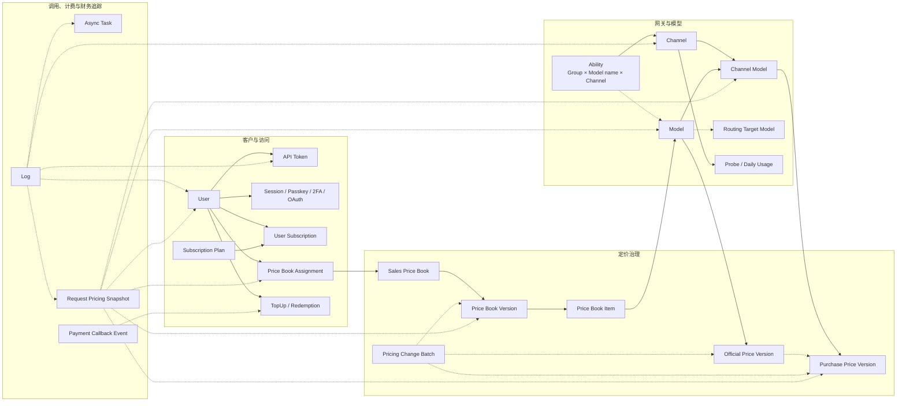

# Frontend V2 Phase 0：领域关系与关联管理盘点

> 状态：Draft v0.1
>
> 日期：2026-08-26
>
> 上位文档：[Frontend V2 完整重构与开发方案](./frontend-v2-development-plan.zh_CN.md)

## 1. 目的

新后台不能只把现有表格换皮，也不能按数据库表逐个重做 CRUD。Phase 0 需要同时回答四个问题：

1. 数据库和服务层中，哪些实体存在直接、逻辑、快照或跨库关系？
2. 现有后台通过哪些页面、表格、表单、弹层和行操作管理这些数据？
3. 一个操作实际影响哪些实体、缓存、计费结果、审计记录和运行状态？
4. 运营人员的高频任务应该收敛成实体工作台、主从视图、工作流还是保留简单弹层？

本文是第一轮代码级盘点和后续人工访谈的执行底稿，不是最终数据库 ERD。最终结论需要由后端负责人、产品、前端和实际使用后台的运营人员共同确认。

## 2. 关系分类

不能只根据字段名判断关系。V2 必须在 API 和界面中明确区分以下四类：

| 类型 | 含义 | 示例 | UI 规则 |
| --- | --- | --- | --- |
| 直接关联 | 通过稳定 ID 指向当前实体 | `ChannelModel.ChannelId → Channel.Id` | 可导航到当前实体，并显示实时状态 |
| 逻辑关联 | 通过名称、业务键或配置建立关系，不一定有数据库外键 | `Ability.Model → Model.ModelName`、`PaymentCallbackEvent.TradeNo → TopUp.TradeNo` | 显示“逻辑匹配”，处理重命名、重复和缺失 |
| 快照引用 | 记录发生时保存名称、价格或配置，历史含义不能被当前值覆盖 | `Log.Username`、`ChannelModelProbe.ChannelName`、`RequestPricingSnapshot` | 当前对象与历史快照并列展示，不自动改写历史 |
| 跨库引用 | 主库、日志库或外部系统间只有可容错关联 | `Log.UserId/ChannelId/RequestId` 与主库对象 | 关联失败时保留历史详情，不能让整页报错 |

界面文案和图例统一使用“当前关联”“历史快照”“逻辑匹配”“对象已不可用”四种语义，禁止把所有关系都表现成可编辑外键。

## 3. 第一版核心关系图

下图是面向后台管理任务的领域图，不包含所有辅助表。实线表示主要当前关联，虚线表示逻辑、快照或追踪引用。



### 3.1 网关与模型

- `Channel` 是上游连接和渠道级配置；模型列表、分组、映射、优先级和权重仍有部分以字符串或 JSON 配置存在。
- `ChannelModel` 是“某渠道提供某逻辑模型”的稳定身份，关联 `ChannelId`、`ModelId` 和 `UpstreamModelName`。
- `Ability` 用 `Group + Model + ChannelId` 决定路由可用性、优先级和权重，其中 Model 目前是名称语义，不等于 `ChannelModel.ModelId`。
- `Model` 还存在 `RoutingTargetModelId` 自关联，代表别名或路由目标。
- `ChannelModelProbe`、`ChannelDailyUsage`、日志和运行指标从不同角度描述渠道健康，但不应继续作为完全割裂的管理入口。

结论：渠道、逻辑模型、渠道模型、Ability、模型映射、探测、用量和采购价格形成一个强关联运维域，不能只靠渠道表格的行操作管理。

### 3.2 客户、访问与计费资格

- `User` 与 API Token、安全凭据、OAuth 绑定、登录会话存在一对多关系。
- User、Token 和 Ability 都使用 Group，但 Group 可能来自配置而非独立关系表；这是需要在 Phase 0 单独确认的共享业务键。
- `UserSubscription`、`SubscriptionOrder` 和 `SubscriptionPlan` 构成订阅生命周期。
- `UserPriceBookAssignment` 决定客户使用的销售价本或版本。
- TopUp、Redemption、使用日志和额度变更共同解释用户余额变化。

结论：用户表格只能用于查找用户；实际管理应进入 User 360，集中查看身份、访问、计费资格、资金和调用行为。

### 3.3 定价治理

- Model 的官方价格通过不可变 `OfficialModelPriceVersion` 版本化，`ModelOfficialPrice` 指向当前版本。
- ChannelModel 的采购价格通过 `ChannelModelPurchasePriceVersion` 版本化，并可引用官方价版本作为依据。
- `SalesPriceBook → SalesPriceBookVersion → SalesPriceBookItem → Model` 构成销售价格发布链。
- `UserPriceBookAssignment` 把用户绑定到价本或指定版本。
- `PricingChangeBatch`、Item、Audit、Circuit 和 Reconciliation 描述变更、风险和运行结果。
- `RequestPricingSnapshot` 在每次请求上固化实际采用的用户、模型、渠道模型、采购价版本、销售价本版本、分配和计费结果。

结论：定价不是普通 CRUD，而是“来源 → 草稿 → 评审 → 发布 → 生效 → 请求采用 → 对账/处置”的版本化工作流。

### 3.4 调用追踪与财务

- Log 通过 UserId、TokenId、ChannelId、RequestId、TaskId 和模型名连接调用上下文，同时保存 Username、TokenName 等快照信息。
- Log 可能位于独立日志库，不能假设存在强外键或与主库处于同一事务。
- Task 包含异步任务状态、渠道、用户、退款、结算和计费上下文。
- RequestPricingSnapshot 是解释“这次请求为什么这样收费、成本和毛利为何如此”的权威追踪对象。
- PaymentCallbackEvent 通过 TradeNo 等业务键与充值订单逻辑关联，并保留验证、处理、重复和错误状态。

结论：日志详情应升级为 Request Trace；财务订单应升级为 Finance Case，分别解释一次调用和一次资金事件的完整链路。

## 4. 现有后台管理方式初审

| 领域 | 当前主要管理方式 | 已有优点 | 主要问题 | V2 方向 |
| --- | --- | --- | --- | --- |
| 渠道 | Collection + 行内编辑、测试、启停；更多菜单包含余额、拉取模型、复制、多 Key 等弹层 | 操作覆盖较完整，批量能力已有基础 | 单行菜单过载；模型、路由、探测、用量、采购价和变更历史分散 | Channel Operations Workspace |
| 模型 | Metadata / Deployments 两个 Tab；模型行支持编辑、启停、删除 | 已开始按子域分组 | 渠道模型、路由目标、官方价、采购价、销售价和使用情况仍在其他页面 | Model Commercialization Workspace |
| 用户 | 表格 + 编辑 Drawer；行菜单管理启停、角色、绑定、订阅、Passkey、2FA 和删除 | 高频安全动作可直接到达 | API Key、资金、价本分配、使用日志和审计仍割裂；高风险动作缺少整体影响上下文 | User 360 |
| 使用日志 | Common / Drawing / Task 表格；通过 Dialog 查看用户和部分上下文 | 筛选、分类和管理员范围已有基础 | 一次请求的用户、Token、渠道、路由、价格快照、任务和错误需要来回跳转 | Request Trace Explorer |
| 采购定价 | ChannelModel 列表 + 筛选、同步、批量导出/删除和价格编辑 Sheet | 已围绕 ChannelModel 建模 | 与模型/渠道工作台、官方价来源和请求采用情况连接不足 | Model Workspace 中的采购价子域 + Pricing Workbench |
| 销售价本 | Price books / Assignments / Change batches；已有版本、diff、评审、发布和审计 | 当前最接近正确的领域工作流 | 单页职责偏多，所选价本/版本上下文容易变复杂 | 保留业务流程，重构为价本 Entity + 发布 Workbench |
| 财务 | Overview、趋势、充值订单、支付渠道、回调事件、用户资金和告警 | 覆盖运营概览较全面 | 订单、用户、回调、额度变更和订阅缺少单个案件视图 | Finance Case + Operations Overview |
| 订阅 | 计划表格 + 创建/编辑 Drawer；用户订阅在用户行菜单 Sheet 中管理 | 计划与用户订阅均已有入口 | 计划生命周期、订单、用户订阅和余额影响分离 | Plan Entity + User 360 订阅 Tab |

初审结论不是“现有页面全部推倒”。销售价本的版本、diff、评审和发布流程，以及现有 DataTable 的筛选、分页和批量选择能力应保留业务经验；需要重做的是跨页面上下文、聚合边界和高风险操作流程。

## 5. V2 六个核心关联管理工作台

### 5.1 Channel Operations Workspace

路由建议：`/admin/gateway/channels/$channelId`

页面结构：

```text
Header：渠道名、Provider、状态、健康度、区域、主操作
Summary：连接、模型数、路由组、24h 调用、错误率、成本
Tabs：
  Overview
  Models & Mapping
  Routing & Groups
  Credentials & Connection
  Health & Probes
  Usage & Cost
  Change History
Context Rail：当前告警、待处理问题、快捷测试
```

关键改进：

- 拉取模型后以 New / Changed / Removed diff 审核，不直接覆盖。
- 修改模型映射、Group、优先级或权重前，预览受影响的 Ability、可用模型和流量范围。
- 禁用或删除渠道前，展示当前承载模型、唯一可用路由、未完成任务和最近调用量。
- 连接测试结果与最近探测、错误日志和延迟趋势放在同一上下文。
- 密钥和多 Key 管理仍是受限子任务，使用独立安全 Sheet/TaskPage，不在 Overview 暴露敏感值。

### 5.2 Model Commercialization Workspace

路由建议：`/admin/catalog/models/$modelId`

Tabs 建议：Overview、Metadata、Channel Deployments、Routing、Official Price、Purchase Price、Sales Coverage、Usage、Audit。

该工作台应能回答：

- 哪些渠道提供该模型，上游名分别是什么？
- 哪些 Group 可以使用，当前优先级、权重和路由目标是什么？
- 官方价和各渠道采购价是否有效，什么时候到期？
- 哪些价本包含该模型，哪些客户会受到变更影响？
- 最近请求实际采用了哪个渠道模型和价格版本？

创建模型不应同时强迫用户配置全部商业信息；采用 Checklist 显示 Metadata、Deployment、Routing、Purchase Price、Sales Coverage 是否就绪，并提供下一步动作。

### 5.3 User 360

路由建议：`/admin/customers/users/$userId`

```text
Header：用户名、角色、状态、Group、余额、风险标记
Tabs：
  Overview
  API Keys & Access
  Security & Bindings
  Subscriptions
  Pricing Assignment
  Balance & Transactions
  Usage & Requests
  Audit
```

关键改进：

- 编辑基础资料与重置 2FA/Passkey、变更角色、调整额度分开授权和确认。
- 价本分配显示当前生效版本、来源、开始/结束时间和下一版本，而不是只显示价本 ID。
- 余额变化可从 TopUp、Redemption、Subscription、Consume、Refund 追溯到来源记录。
- 禁用或删除用户前预览有效 Token、未完成 Task、有效订阅、未结订单和价本分配。
- 使用日志从 User 360 带着用户筛选进入 Request Trace，返回时保留上下文。

### 5.4 Request Trace Explorer

路由建议：`/admin/operations/requests/$requestId`

采用 Mail 式主从布局。左侧是可保存筛选的请求列表，右侧详情按以下 Tabs 组织：

- Overview：状态、用户、Token、模型、渠道、耗时、Token、收费和 request ID；
- Routing：Group、候选渠道、最终渠道、重试、亲和和熔断信息；
- Request / Response：脱敏后的协议、参数、上游 ID 和错误；
- Billing：RequestPricingSnapshot、预扣、结算、退款、采购成本、销售金额和毛利；
- Task：异步任务状态、进度、结果、结算与回调；
- Timeline：关键阶段及关联审计事件。

Request Trace 以只读诊断为主。退款、人工结算或异常处置是独立领域命令，必须记录原因、权限和审计 ID。

### 5.5 Pricing Governance Workbench

路由建议：保留 official、purchase、price-books 和 reconciliation 一级入口，但共享同一个模型/版本上下文。

目标流程：

```text
官方来源同步
  → 官方价版本审核/生效
  → 渠道采购价草稿/合同有效期
  → 销售价本版本生成
  → 变更 diff、覆盖率、毛利和客户影响检查
  → 评审/发布/定时生效
  → 请求价格快照验证
  → 对账、熔断和异常处置
```

关键改进：

- 所有价格页面提供 Model / ChannelModel 上下文跳转和版本血缘。
- Published/Active 版本不可直接编辑；修改总是创建新 Draft。
- 发布前同时检查缺失模型、无采购价、过期合同、低毛利、受影响客户和运行时熔断状态。
- Change Batch 使用工作流时间线，不用普通 status 下拉框模拟状态机。
- 对账异常可直接打开对应 Request Trace 和 Price Version diff。

### 5.6 Finance Case

路由建议：`/admin/finance/cases/$tradeNo`，也可以由订单、回调或告警入口打开同一案件。

详情聚合：订单、用户、支付 Provider、回调尝试、验证结果、重复事件、额度入账、订阅订单、人工处理和审计记录。

关键改进：

- “人工完成订单”前显示现有支付/回调状态、是否已入账、重复风险和用户当前余额。
- 所有人工操作要求原因，并返回不可变审计记录。
- 回调 Payload 只展示已脱敏 Preview 和 Digest，不把签名、凭据或完整敏感载荷带到前端。
- Finance Overview 继续用于趋势和告警；案件页用于解释和处理单个异常，不把两种任务混在一张超宽表里。

## 6. 如何选择管理方式

| 关系和任务特征 | 推荐模式 | 不推荐 |
| --- | --- | --- |
| 高频一对多查看，编辑较少 | EntityPage + Tab + 分页关联表 | 每条关联都开独立一级菜单 |
| 高频从列表定位并连续查看详情 | 可调整宽度的 Master–Detail | 每次打开全屏页面再返回列表 |
| 多对多选择且候选很多 | 可搜索双栏选择器、已选摘要、批量校验 | 原始 ID 输入或超长 Select |
| 跨多个实体且有明确状态推进 | TaskPage / Workflow + Timeline | 普通表单 + 可随意修改的 status 下拉框 |
| 高风险跨表写操作 | Impact Preview + Confirm + Server Command | 前端连续调用多个更新接口 |
| 不可变版本或历史记录 | Version List + Diff + Audit Timeline | 覆盖式编辑 |
| 需要解释依赖和传播范围 | 有限领域 Dependency Graph | 通用全库 ER 图塞进业务页面 |
| 低频辅助查看 | Linked Records Sheet | 永久占用主页面空间 |
| 低风险、少字段、无关联副作用 | Dialog / Inline Edit | 独立复杂工作台 |

判断顺序：先看操作者任务，再看一致性边界，其次看频率、风险和数据量，最后才决定组件。关系多不等于页面一定复杂；只有对决策或操作有帮助的关系才进入首屏。

## 7. 表单、表格和批量操作规范

### 7.1 关系感知表单

- 关联字段使用领域选择器，展示名称、状态、关键约束和不可选原因，禁止要求用户记忆数字 ID。
- 选中关联对象后立即显示上下文摘要，例如价本版本、合同有效期、渠道健康度或用户当前 Group。
- 服务端字段错误除了字段路径，还应返回关联对象和阻断原因。
- 编辑期间保存实体版本或 ETag；提交时发现关联对象已变化，展示冲突 diff，不静默覆盖。
- 动态 JSON 配置继续由领域编辑器管理，只有高级模式才允许查看原始 JSON，并提供 schema 校验和 diff。

### 7.2 关系感知表格

- 主表只显示能帮助判断的关联摘要，例如 `5 个渠道 / 2 个异常`，详情进入 Sheet 或 EntityPage。
- 支持从关联列直接添加筛选，例如点击渠道、用户、模型或状态 Chip。
- 保存的 View 必须包含筛选、排序、列和作用域，但不保存敏感数据。
- 关联对象不存在时保留历史显示名和 ID，并提供“对象已删除”状态；不得显示空白单元格误导用户。

### 7.3 批量操作

批量操作分为三步：

1. Preflight：服务端按选中 ID 校验权限、当前版本、依赖和可执行项。
2. Review：界面分组显示将成功、将跳过、需修复和高风险项目。
3. Execute：服务端领域命令执行并返回逐项结果、审计 ID 和需要刷新的聚合。

批量选择必须明确是“当前页”“当前筛选全部”还是“手动选中”，不能用视觉上相同的全选框表达三种语义。

## 8. 后端契约需求

现有细粒度 CRUD API 不必全部废弃，但 V2 至少需要补齐：

1. 六个工作台的首屏聚合 Summary API；
2. 关联子资源的服务端分页 API；
3. 删除、禁用、发布、分配、人工结算等操作的 Impact Preview；
4. 表达业务意图且具有事务和审计的 Command API；
5. 请求追踪、价格血缘、余额变化和财务案件的 Timeline API；
6. 统一 `EntityRef`：`id`、`display_name`、`status`、`exists`、`snapshot_name`、`capabilities`；
7. 统一并发冲突、依赖阻断、部分成功和审计结果错误契约。

聚合 API 只提供首屏需要的有限摘要。大列表继续分页，避免一次返回一个用户的全部日志、一个渠道的全部探测或一个模型的全部历史价格。

## 9. Phase 0 盘点矩阵

每个核心实体和写操作都需要填写以下字段：

| 字段 | 说明 |
| --- | --- |
| Domain / Aggregate | 所属领域和聚合根 |
| Model / Table | GORM Model、表名和数据库位置 |
| Stable Identity | 主键、业务键和重命名策略 |
| Direct Relations | 通过稳定 ID 的关系 |
| Logical Relations | 名称、Group、TradeNo、RequestId 等业务键关系 |
| Snapshot Fields | 必须按历史保留的名称、价格和配置 |
| Current UI Entry | 当前路由、页面、表格、弹层和入口 |
| Current Actions | 创建、编辑、启停、删除、发布、分配、导入和批量操作 |
| Write Chain | Router → Controller → Service → Model 的真实调用链 |
| Side Effects | 关联表、缓存、额度、任务、通知、审计和外部调用 |
| Invariants | 删除约束、唯一性、状态机、计费和安全不变量 |
| Pain Points | 当前步骤、重复输入、上下文丢失、误操作和权限问题 |
| Target Pattern | Collection、Entity、Master–Detail、Workflow 或 Analysis |
| API Gap | Summary、分页、Impact、Command、Timeline 和 OpenAPI 缺口 |
| Migration | 新路由、兼容方式、灰度开关、回滚和旧代码删除条件 |

写操作另建 Action Matrix：

| 页面动作 | capability | 输入 | 读取关系 | 写入实体 | 事务边界 | 缓存失效 | 审计 | 风险 | V2 交互 |
| --- | --- | --- | --- | --- | --- | --- | --- | --- | --- |
| 示例：禁用渠道 | `channels.write` | Channel ID + version | Ability、ChannelModel、未完成 Task、近期用量 | Channel status | 待确认 | 路由/模型缓存 | 必须 | 高 | Impact Preview + 名称确认 |

示例只定义盘点格式，不能代替后端代码审计；特别是“事务边界”和“缓存失效”必须沿实际调用链确认。

## 10. Phase 0 执行步骤与验收

### 10.1 代码盘点

1. 从 `model/main.go` 和各 GORM Model 建立实体清单。
2. 搜索所有 `Where`、`Joins`、事务、删除校验、状态更新和缓存失效，补齐隐式关系。
3. 从 Router、Controller 和 Service 追踪高风险写操作。
4. 从现有前端 route、feature、DataTable、Drawer、Dialog 和 API 文件提取管理入口与操作。
5. 对日志库、JSON 配置、历史快照和软删除单独标记。

### 10.2 任务观察

对渠道接入、模型商业化、用户处置、请求排障、价格发布、订单异常六类任务各观察至少 5 次真实或 staging 操作，记录：

- 起点和完成标准；
- 打开的页面和切换次数；
- 复制粘贴或重复搜索的字段；
- 需要依赖个人经验判断的隐藏关系；
- 最容易误操作或无法恢复的步骤；
- 当前缺少的影响信息和审计证据。

### 10.3 原型验证

每个工作台至少提供：

- 桌面端主流程；
- 1280px 密集数据状态；
- 移动端只读与关键操作路径；
- loading、empty、partial、error、forbidden 和 stale 状态；
- 一个高风险操作的 Impact Preview；
- 关联对象缺失和历史快照示例。

### 10.4 退出条件

- 六个核心聚合的实体、关系、状态和负责人已确认；
- P0 写操作已完成 Action Matrix，没有“前端猜测副作用”的项目；
- 每个现有后台入口都有目标工作台、保留/合并/删除结论和迁移波次；
- 需要新增的 Aggregate、Impact、Command、Timeline API 已进入 OpenAPI backlog；
- 实际运营人员能使用原型完成高频任务，并能在提交前解释操作影响；
- 后端确认跨表写入仍满足 SQLite、MySQL 和 PostgreSQL 一致性要求。

## 11. 第一轮优先级结论

1. **P0：Channel Operations Workspace**。当前渠道行操作最多，且与模型、Ability、探测、用量和采购价关系最密集。
2. **P0：Request Trace Explorer**。它是网关排障、计费解释、任务退款和价格对账的共同入口。
3. **P0：User 360**。现有用户行菜单已显露聚合需求，但资金、Token、价本、用量和安全仍然分散。
4. **P0：Model Commercialization Workspace**。将模型元数据、渠道模型、路由和定价串成可检查的上线流程。
5. **P0：Pricing Governance Workbench**。保留现有价本版本、diff、评审和发布能力，补齐血缘、影响和运行验证。
6. **P1：Finance Case**。先保留现有 Finance Overview，再为支付和入账异常增加案件详情与人工处置闭环。

这六项不是六套互相复制的页面。它们共享 `EntityDetailLayout`、`LinkedRecordsPanel`、`ImpactPreview`、`VersionDiff`、`AuditTimeline`、`MasterDetail` 和服务端 DataGrid 等 Pattern；只有领域内容、权限和命令不同。

## 12. 第一轮代码依据

核心数据关系主要来自：

- [`model/main.go`](../model/main.go)：迁移实体清单；
- [`model/channel.go`](../model/channel.go)、[`model/ability.go`](../model/ability.go)、[`model/model_meta.go`](../model/model_meta.go)、[`model/channel_model_pricing.go`](../model/channel_model_pricing.go)：渠道、模型、路由和定价关系；
- [`model/user.go`](../model/user.go)、[`model/token.go`](../model/token.go)、[`model/subscription.go`](../model/subscription.go)、[`model/sales_price_book.go`](../model/sales_price_book.go)：用户、访问、订阅和价本关系；
- [`model/log.go`](../model/log.go)、[`model/task.go`](../model/task.go)、[`model/payment_callback_event.go`](../model/payment_callback_event.go)：调用、异步任务、计费和支付追踪。

现有管理方式初审主要来自：

- [`web/src/features/channels`](../web/src/features/channels)、[`web/src/features/models`](../web/src/features/models)、[`web/src/features/users`](../web/src/features/users)；
- [`web/src/features/usage-logs`](../web/src/features/usage-logs)、[`web/src/features/pricing-admin`](../web/src/features/pricing-admin)、[`web/src/features/sales-price-books`](../web/src/features/sales-price-books)；
- [`web/src/features/finance`](../web/src/features/finance)、[`web/src/features/subscriptions`](../web/src/features/subscriptions)。

这些路径只证明第一轮代码现状。Phase 0 仍需继续追踪 Router、Controller、Service、缓存失效、权限和真实运营步骤，才能冻结最终 Action Matrix。
