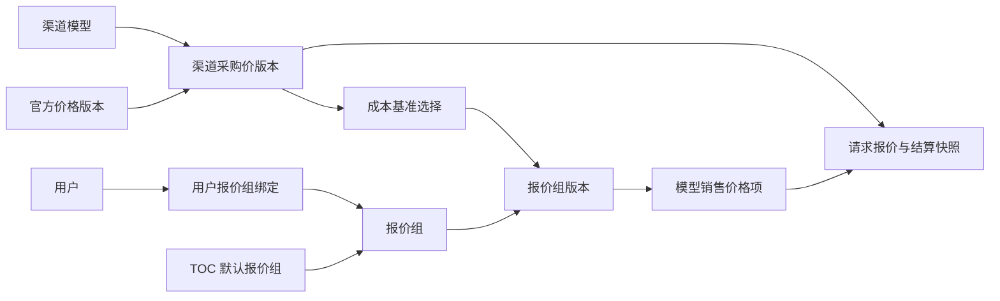

# 销售报价组开发、测试与验收计划

## 1. 目标与范围

本项目把“上游采购价格”和“对外销售报价”从渠道路由中解耦，形成企业级的报价组（Price Book）能力：

- 一个逻辑模型可以接入多个上游渠道，每个渠道独立维护采购价、折扣和生效版本。
- TOC 使用平台默认报价组；TOB 用户直接绑定报价组，不依赖传统用户分组。
- 同一报价组内，同一逻辑模型只有一个对外销售价；实际请求路由到不同上游时，用户价格不变，仅内部毛利不同。
- 官方价格或采购价变化时，先生成变更批次和新报价版本，经预览、风险检查、审批后发布，不直接覆盖历史价格。
- 每次请求保存采购版本、报价组版本、表达式哈希和最终结算结果，可重放、可审计、可对账。

开发分支约束：

- 不修改线上数据，不在本阶段部署到线上。
- 本地迁移以新版本为准，删除旧定价表、旧接口和旧页面，不保留双轨运行时。
- 不把“渠道可用性探测”作为销售报价的唯一依据；探测只参与路由可用性和风险提示。
- 不允许已发布报价版本原地修改。

## 2. 核心业务模型

价格关系：

- 采购价是内部成本事实，按“渠道模型 + 版本 + 生效时间”维护。
- 销售价可以来源于采购成本加成、官方价折扣或固定价格，但发布后是独立、不可变的商业承诺。
- 运行时先确定用户报价组和模型销售价格，再从可用渠道中选择路由并计算内部成本。
- 销售表达式只执行一次；每个候选渠道分别执行采购表达式并计算预计毛利。

## 3. 数据表方案

### 3.1 新增表

| 表 | 用途 | 关键约束 |
| --- | --- | --- |
| `sales_price_books` | 报价组稳定身份 | `code` 唯一；区分 `toc/tob/internal`；指向当前版本 |
| `sales_price_book_versions` | 报价组不可变版本及公共费率策略 | `(price_book_id, version)` 唯一；发布后不可修改 |
| `sales_price_book_items` | 一个版本内每个逻辑模型的唯一销售价 | `(price_book_version_id, model_id)` 唯一 |
| `sales_price_book_item_basis_sources` | 记录销售价生成时采用或比较过的采购来源 | 报价项、渠道模型、采购版本、阶梯和组件联合唯一 |
| `sales_price_book_defaults` | 平台默认报价组 | `default_key` 主键；首期支持 `toc_default` |
| `user_price_book_assignments` | TOB 用户与报价组绑定历史 | 同一时刻一个用户只能有一个有效绑定，由事务替换 |
| `pricing_change_batches` | 官方价/采购价变化触发的批量重算任务 | `batch_no`、`idempotency_key` 唯一 |
| `pricing_change_batch_items` | 批次内逐模型差异、毛利和风险结果 | 保留新旧表达式哈希与参考价格 |
| `pricing_approval_records` | 发布、审批、撤销等操作审计 | 按对象和操作记录操作者及时间 |

### 3.2 原表修改

| 原表 | 修改 | 兼容方式 |
| --- | --- | --- |
| `request_pricing_snapshots` | 增加报价组、版本、报价项、用户绑定、销售表达式、费率拆分及解析时间字段；`retail_amount`/`base_retail_amount` 迁移为 `sales_amount`/`base_sales_amount` | 历史金额保留；旧零售价版本引用删除 |
| `channel_model_purchase_price_versions` | 不改语义，继续作为渠道采购成本的权威版本 | 新报价生成和运行时成本计算直接引用该版本 |
| `model_official_price_versions` | 不改语义，继续作为官方价基准 | 官方价变更可触发报价变更批次 |
| `channel_models` | 不存储客户销售价，只表示渠道与逻辑模型映射及运行状态 | 继续供路由、探测和采购价管理使用 |
| `users` | 首期不新增报价组字段 | 通过绑定历史表保持可追溯性，避免覆盖式单字段失去历史 |

### 3.3 旧对象退役

| 旧对象 | 最终处理 |
| --- | --- |
| `channel_model_retail_price_versions` | 首次新版本迁移时物理删除；销售价历史由请求快照和报价组版本保存 |
| 渠道维度零售价编辑、模拟和导出对比接口 | 删除路由、控制器、服务和前端页面 |
| `ChannelModelRetailPriceVersionId` 请求快照字段 | 删除；新请求保存采购版本、报价组、报价版本和报价项 |
| `channel_models.runtime_mode` | 删除；所有请求只运行“报价组销售价 + 渠道采购价”路径 |
| 销售价格生成旧页面 | 合并进报价组草稿的“生成报价项”流程后删除 |
| 定价运行时功能开关 | 删除，避免配置漂移和双轨账单 |

首次迁移前必须备份数据库；迁移负责先重命名历史销售金额列，再删除无法继续参与结算的旧引用和旧表。

## 4. 生命周期与权限

### 4.1 报价组

`draft -> enabled -> disabled -> archived`

- 创建报价组时只建立稳定身份。
- 第一个版本发布后报价组进入 `enabled`。
- `disabled` 阻止新绑定和默认解析，但不影响历史快照。
- `archived` 不允许创建新版本。

### 4.2 报价版本

`draft -> active -> superseded`

预留 `scheduled` 和 `cancelled`：

- 草稿可编辑、批量生成、风险复核。
- 发布必须校验至少一个模型、所有启用项表达式可编译、无待复核项、内容哈希一致。
- 新版本激活时，上一当前版本原子切换为 `superseded`。
- 已发布版本只读；更正必须复制为新草稿。

### 4.3 用户绑定

- `follow_current`：用户自动跟随报价组当前版本，适合普通 TOB 合同。
- `pin_version`：锁定某个已发布版本，适合合同期固定价。
- 新绑定在一个事务内终止旧绑定并创建新记录，不覆盖历史。
- 请求解析优先级：有效用户绑定 > TOC 默认报价组；TOB 用户没有有效绑定时是否允许回落由运行时策略明确控制。
- 首期策略确定为：TOB 用户没有有效绑定时回落到已审核的 TOC 默认报价组；报价组停用、版本未生效/已过期或缺少模型报价项时明确失败，不读取草稿或旧渠道零售价兜底。

## 5. 批量更新策略

### 5.1 触发来源

- 官方价格版本发布。
- 渠道采购价格版本发布或折扣变化。
- 财务公共费率变化（付款手续费、分销手续费、运维人力成本、税率、目标净利率）。
- 管理员手工发起指定模型或报价组重算。

### 5.2 执行流程

1. 创建幂等的 `pricing_change_batches`。
2. 解析受影响的逻辑模型和报价组，不修改当前有效版本。
3. 为每个报价组创建新草稿，复制未受影响模型项。
4. 按成本基准策略选择采购来源：最高合格成本、指定渠道、最低合格成本、官方价或人工基准。
5. 生成新销售表达式，记录全部成本来源及选择原因。
6. 计算新旧价格、各渠道毛利、最低毛利、涨跌幅和风险代码。
7. 超过涨价上限、低于最低毛利、缺少成本或渠道不可用时标记 `review_required`。
8. 管理员预览差异，审批后发布；发布采用事务和内容哈希防止并发篡改。

## 6. 开发里程碑

### M0：分支与基线

- [x] 创建 `codex/sales-price-books` 分支。
- [x] 确认所有开发仅发生在 `codex/sales-price-books` 分支。
- [x] 记录现有测试基线。
- 验收：工作区不修改线上配置、不推送、不部署。

### M1：数据层和基础 API

- [x] 新增报价组、版本、价格项、绑定、默认项、变更批次和审批表。
- [x] 增加 SQLite/MySQL/PostgreSQL 共用的 GORM 迁移。
- [x] 实现创建、查询、编辑草稿、发布、绑定用户、设置 TOC 默认报价组。
- [x] 补充报价组停用、复制版本、取消绑定和默认项查询。
- [ ] 补充报价组与绑定记录的服务端分页筛选。
- 验收：发布版本不可修改；重复模型项被唯一约束拒绝；用户有效绑定原子切换。

### M2：批量生成与变更批次

- [x] 把现有销售价格生成规则接入报价组草稿。
- [x] 支持只生成所选模型，并按逻辑模型去重。
- [x] 保存成本基准来源、计算因子、表达式哈希和生成批次。
- [x] 提供风险项和批次详情接口。
- [ ] 补充新旧版本逐字段差异预览和双人审批流。
- 验收：同一逻辑模型无论有几个渠道，报价版本中只有一个销售价格项；所有渠道毛利均可预览。

### M3：管理页面

- [x] 新增“销售报价组”页面和菜单。
- [ ] 报价组列表支持名称、编码、受众、状态筛选，默认每页 200 条（当前已支持名称/编码本地筛选）。
- [x] 版本页支持创建草稿、复制当前版本和发布。
- [ ] 版本页补充新旧版本差异视图。
- [x] 模型选择复用渠道定价筛选、全选当前页、反选和每页 200 条，支持批量生成所选。
- [ ] 模型报价项导出。
- [x] 用户绑定支持选择报价组、跟随当前版本或锁定版本、合同/报价编号。
- [ ] 用户绑定补充用户名搜索和服务端分页。
- 验收：宽表横向滚动；长表分页可调整；所有用户可见文本进入 i18n。

### M4：单一运行时

- [x] 实现用户绑定优先、TOC 默认回落和销售价一次解析。
- [x] 同一销售价对多个采购候选计算不同内部毛利。
- [x] 目录只加载采购价候选，销售价只从报价组解析。
- [x] 明确 TOB 无绑定、报价模型缺失、版本过期的失败策略。
- [x] 模型广场按匿名 TOC 默认报价或登录用户绑定报价展示，同一报价在不同可用分组中保持一致。
- [x] 完成账单预扣、结算、退款和任务异步结算的全链路快照。
- 验收：客户扣费不随最终路由变化；报价或采购价缺失时明确失败，不存在旧价格回落。

### M5：迁移与退役

- [x] 历史请求金额列原地重命名为销售金额列。
- [x] 删除旧渠道零售价表、运行模式列和旧快照版本引用。
- [x] 删除旧接口、旧页面、功能开关及旧回退路径。
- [ ] 在生产数据库副本完成迁移演练和账单抽样核对。
- [ ] 测试环境全量验收通过后安排一次性线上迁移窗口。
- 验收：迁移重复启动安全；历史金额可查；新运行时没有任何旧表、旧接口或旧配置依赖。

## 7. 测试矩阵

### 7.1 后端单元与服务测试

| 场景 | 关键断言 |
| --- | --- |
| 公共费率 | 付款 + 分销 + 运维必须严格等于 VCR；非法税率/利润率拒绝 |
| 表达式 | 只接受 billingexpr V2；哈希与内容一致；显式零值不丢失 |
| 发布 | 空版本、待复核项、坏表达式、哈希不一致均不能发布 |
| 版本不可变 | 已发布价格项和版本策略不能更新 |
| 用户绑定 | 有效绑定优先；替换保留历史；锁定版本必须属于对应报价组且有效 |
| 默认报价 | 无用户绑定时解析 `toc_default`；无默认或无模型项时明确失败 |
| 多渠道 | 客户销售价相同；采购成本和毛利按候选渠道不同 |
| 时间边界 | 生效开始、结束、锁价期边界准确 |
| 并发 | 同一报价组版本号唯一；发布和绑定切换使用行锁/事务 |
| 审计 | 请求快照保存报价组、版本、项目、表达式哈希和采购版本 |

### 7.2 数据库兼容测试

- SQLite：临时数据库执行完整迁移、创建、发布、绑定、解析和回滚测试。
- MySQL 5.7.8+：验证索引长度、`TEXT` 字段、事务和 `FOR UPDATE`。
- PostgreSQL 9.6+：验证标识符、布尔/时间字段、唯一约束和事务。
- 不使用数据库专属 JSON 列、部分索引或不兼容的 `ALTER COLUMN`。

### 7.3 前端测试

- API 契约：路径、查询参数、请求体和错误响应。
- 报价组创建：必填项、费率自动求和、异常提示。
- 选择行为：全选筛选结果、反选、跨页选择和只生成所选。
- 版本行为：草稿可编辑、已发布只读、发布确认、差异展示。
- 用户绑定：跟随/锁定联动，合同编号保存，替换确认。
- 布局：宽表可横向滚动，分页默认 200 且可调整。
- 运行 `bun run typecheck`、相关 Vitest、涉及文件 lint 和 `bun run build`。

### 7.4 端到端验收数据

准备最小但完整的本地数据：

- 2 个逻辑模型。
- 每个模型至少 2 个上游渠道，采购折扣不同。
- 1 个 TOC 默认报价组。
- 2 个 TOB 报价组，其中一个跟随当前版本，一个锁定版本。
- 3 个测试用户：普通 TOC、跟随报价组 TOB、锁定报价组 TOB。

验证：三个用户访问同一模型得到预期销售价；同一用户切换路由后扣费不变；官方价变化生成新草稿但旧合同价格在发布前不变。

## 8. 验收清单

功能验收：

- [x] 采购价变化不会直接覆盖对外销售价。
- [x] 同一报价组、同一模型只有一个有效销售价。
- [x] TOB 用户无需用户分组即可绑定报价组。
- [x] 报价组支持跟随当前版本和合同锁定版本。
- [ ] 官方价变化可批量生成新版本并展示差异和风险。
- [x] 已发布版本、历史绑定和请求价格均可追溯。

安全与回滚验收：

- [x] 单一运行时找不到报价时明确失败，不使用未审核的临时价格。
- [x] 所有金额和费率计算沿用 billingexpr 与安全 quota 转换规范。
- [x] 不提供旧运行时回滚；发布前依靠数据库备份、镜像回滚和迁移演练控制风险。

质量验收：

- [x] 受影响 Go 测试通过。
- [x] 前端 typecheck、全量测试、受影响文件 lint 和生产构建通过。
- [ ] SQLite/MySQL/PostgreSQL 兼容验证通过。
- [x] 本地端到端验收记录完整。
- [x] 不包含线上数据修改、线上开关变更或部署操作。

## 9. 当前基线与已知问题

- 分支：`codex/sales-price-books`。
- 新表、基础生命周期 API、用户解析器、管理页面、采购价目录、单一运行时、模型广场报价和服务测试已经完成。
- 当前分支尚未部署线上；合并发布后不存在旧定价运行时。
- 仓库现有完整 `go test ./...` 基线仍有与本功能无关的失败：`model/log_format_test.go` 的 `int`/`int64` 断言，以及 OpenAPI 清单未覆盖既有 relay 路由；本功能测试结果与该基线分开记录。
- 仓库全量 Oxlint 仍有多个既有错误；本次改动文件的 Oxlint 已单独通过，未顺带修改范围外代码。

## 10. 2026-08-24 本地验收记录

- SQLite：使用独立临时数据库启动完整服务，迁移成功；九张报价组相关表均已创建；`GET /api/status` 成功，`/sales-price-books` 返回前端页面；服务已正常停止。新增退役迁移回归测试，确认历史销售金额保留、旧价格表和旧列被删除且重复迁移安全。
- 后端：`go test ./service/pricingadmin ./service/pricingruntime ./middleware ./controller ./relay -count=1` 通过；新增覆盖报价生成幂等、成本组件上界、版本复制、绑定历史、匿名 TOC、用户 TOB、采购价专用路由和请求价格快照。
- 前端：`bun run typecheck`、相关 Oxlint、报价组 Vitest、`bun run i18n:sync`、`bun run build` 均通过。
- MySQL/PostgreSQL：本机未配置 `TEST_MYSQL_DSN` 和 `TEST_POSTGRES_DSN`，尚未执行真实数据库兼容验收，因此三数据库总验收保持未完成。
- 发布边界：未连接线上数据库，未修改线上配置，未推送、未部署。
